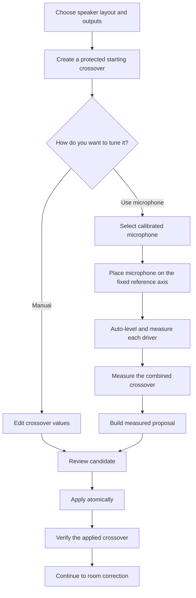

# Active Crossover Builder: product and architecture specification

> **Status: design of record.** This document owns the intended user experience,
> product states, parameter-ownership rules, and implementation boundaries for
> manually or automatically commissioning an active crossover in JTS. Low-level
> DSP and hardware-safety contracts remain canonical in
> [`HANDOFF-active-speaker-dsp.md`](HANDOFF-active-speaker-dsp.md); shared capture
> and analysis primitives remain canonical in
> [`HANDOFF-audio-measurement-core.md`](HANDOFF-audio-measurement-core.md); room
> correction remains canonical in [`HANDOFF-correction.md`](HANDOFF-correction.md).
> Those documents should link here for crossover-builder product behavior rather
> than restating it.

## Product goal

JTS should let a user commission an active two-way or three-way speaker in one
of two equally supported ways:

1. **Manual:** the user enters the crossover frequency, filter family and slope,
   driver trim, polarity, and relative delay they want. JTS previews, validates,
   applies, and verifies that exact crossover.
2. **Automatic:** JTS guides the user through calibrated-microphone placement,
   measures each driver independently and in combination, proposes those same
   crossover values from acoustic evidence, and applies them only after the user
   reviews an explicit before/after comparison.

The two paths must converge on the same crossover model, compiler, application
transaction, verification step, and rollback behavior. Automatic commissioning
is not a second kind of crossover and must not create a second settings store.

The feature should be powerful enough for an experienced builder to understand
and control the result, while the normal path feels like a calm sequential
setup—not a measurement laboratory. At any point the user should understand:

- what JTS needs them to do next;
- whether sound is about to play and through which driver;
- which values are manual, measured, proposed, or currently applied;
- why JTS accepted or rejected a measurement;
- what will change if they press Apply; and
- how to return to the previously working crossover.

## Product promise

The crossover builder makes four promises:

1. **Manual control is first-class.** A knowledgeable user can set the values
   directly without performing microphone measurements or invoking an AI helper.
2. **Automatic means measured.** Automatic values come from the user's current
   speaker, microphone calibration, applied test graph, and captured acoustic
   evidence—not merely driver datasheets or an LLM guess.
3. **Overwrite is explicit.** An automatic result may replace a manually tuned
   crossover, but only through an explicit comparison and confirmation. It never
   silently rewrites live settings.
4. **Room correction comes second.** Room correction may begin only after the
   driver-domain crossover is applied and its combined response has been
   verified. Room correction must not be used to disguise a broken driver
   handoff.

## Scope

### In scope

- Passive/full-range, active two-way, and active three-way layouts, with the
  existing optional-subwoofer topology represented where the runtime supports
  it.
- Manual crossover frequency, family/order, slope, trim, polarity, and delay.
- A guided calibrated-microphone flow for per-driver level, response, usable
  overlap, polarity, delay, and combined-response evidence.
- Deterministic automatic proposals for crossover values.
- Preview, explicit apply, post-apply verification, and rollback.
- Evidence and state surfaces sufficient to diagnose a failed run without
  repeating it blindly.
- A clean handoff into room correction after commissioning succeeds.

### Not in the first working release

- Automatic limiter, excursion, or thermal-model design.
- Automated high-output compression testing.
- Arbitrary optimizer plug-ins or a general-purpose loudspeaker CAD framework.
- Unbounded per-driver EQ or automatic positive-gain correction.
- Listening-preference EQ or room-response target curves; those belong to later
  DSP layers.
- An LLM directly authoring or applying live DSP. Research may suggest safe
  starting constraints, but measured deterministic code owns the proposal.

These are deliberate boundaries, not a claim that the omitted work is
unimportant. The first release must work reliably and be understandable. More
safety and analysis can be added behind the same contracts once the measurement
and application loop is proven on hardware.

## First principles

An electrical crossover setting is not the acoustic crossover the user hears.
For each driver, the acoustic result is the product of the mounted driver's
response, the electrical filter, EQ, gain, polarity, and propagation delay. The
speaker output is the complex sum of all active drivers.

Therefore a crossover is commissioned only when JTS has addressed:

1. each driver's protected and usable frequency range;
2. a crossover frequency inside a clean overlap region;
3. the **acoustic** high-pass and low-pass shapes, not only their electrical
   labels;
4. relative driver level through the handoff region;
5. polarity and relative acoustic delay;
6. the combined response with both drivers playing;
7. gross off-axis or vertical-lobing problems where the measurement tier can
   observe them; and
8. headroom for the proposed filters and trims.

A tone at one frequency is useful for setting a safe capture level. It is not
enough to design a crossover. A protected logarithmic sweep provides the
broadband magnitude and impulse evidence; separate and summed measurements
provide the handoff evidence.

## One model, three states

The existing `ActiveSpeakerPreset` vocabulary is the semantic source of truth
for crossover values. Extend that vocabulary when the product gains a real
parameter; do not introduce a parallel automatic-crossover schema.

The product has three states with different authority:

| State | Purpose | Can affect sound? |
|---|---|---:|
| **Working crossover** | The user's editable manual values or the latest reviewed automatic proposal | No |
| **Candidate** | A frozen, validated snapshot compiled from the working crossover and its evidence | No |
| **Applied crossover** | The active speaker preset confirmed by the DSP runtime | Yes |

Measurement records are evidence, not a fourth settings store. They may produce
a new working proposal, but they never become live merely because a capture
completed.

The applied crossover is authoritative for playback. The working crossover is
authoritative for the form. The candidate records exactly what would be applied.
The UI must never merge values from those states implicitly.

Working crossovers and candidates are strictly silent: the crossover preview
emits no audio and no CamillaDSP YAML, may not stage or load a graph, and may
not authorize playback (enforced today by
`jasper.active_speaker.crossover_preview`'s no-audio permissions). Reviewing a
proposal must remain possible even while safety gates block staging or
playback — a blocked speaker can still show what JTS is thinking.

### Parameter provenance

Every candidate should be able to explain where each value came from:

- `manual` — entered or edited by the user;
- `measured` — derived from the current measurement session;
- `recommended_start` — a conservative starting value from driver/profile
  constraints, not yet proven acoustically; or
- `preserved` — carried unchanged from the applied crossover.

Provenance is metadata on the canonical value, not a second value. It exists so
the comparison and diagnostics can be honest.

The shipped substrate carries a narrower, per-role trim provenance
(`explicit` / `measured` / `sensitivity` / `none` in the baseline-profile
layer). Implementation migrates that vocabulary into this per-parameter one —
`sensitivity` maps to `recommended_start`, `explicit` to `manual` — rather
than running two provenance models side by side.

### Replacement semantics

- Applying a manual candidate replaces the applied crossover with the visible
  manual values.
- Running automatic commissioning produces a proposal; it does not edit the
  applied crossover.
- **Replace with measured crossover** shows every changed parameter and then
  applies the automatic candidate atomically.
- Returning to Manual after an automatic proposal edits the same working
  crossover.
- Re-running automatic commissioning creates new evidence and a new proposal;
  it does not rewrite historical evidence.
- The immediately previous applied crossover remains the rollback target.

The first release should use one all-or-nothing comparison and Apply action. A
matrix of per-field locks or optimizer weights would add complexity before a
named user need justifies it. An expert who wants a hybrid result can accept the
proposal, switch to Manual, edit it, and apply the resulting manual candidate.

## User experience

The `/sound/` surface owns speaker layout, output identity, and manual editing.
The HTTPS `/correction/crossover/` surface owns microphone permission and
acoustic commissioning. They are two views of the same working and applied
crossover, not independent wizards.

The normal experience presents one primary action at a time.

### Step 1: choose the speaker and outputs

Ask only what is needed to establish the physical topology:

- mono or stereo;
- passive, active two-way, or active three-way;
- optional subwoofer when supported;
- driver role on each physical DAC/amplifier output; and
- confirmation that the output actually feeds the named driver.

Hardware discovery supports this step but should not dominate it. The user sees
physical language such as **Woofer · Output 1**, not internal channel-map nouns.
Changing an output assignment invalidates measurement evidence tied to the old
assignment.

### Step 2: establish a protected starting crossover

Automatic commissioning cannot safely discover a tweeter's lower limit by
sending it an unrestricted sweep. Before any driver plays, JTS needs a
conservative starting graph containing:

- output routing;
- an initial crossover frequency and slope;
- driver-specific high-pass protection where required;
- conservative trims; and
- the existing test-volume bounds.

The user may enter this starting point manually or use research/profile data to
prefill the visible fields. Prefill is advice. The visible working crossover is
the source of truth, and the backend validates the resulting graph before it
can emit sound.

### Step 3A: manual crossover

Manual mode exposes, per crossover region:

- crossover frequency;
- filter family and order/slope;
- lower-driver and upper-driver trim;
- polarity;
- relative delay; and
- advanced bounded driver EQ only when the existing preset/compiler supports
  it as a real product parameter.

The default view can keep polarity, delay, and advanced corrections collapsed,
but they must remain reachable. Manual does not mean unvalidated: JTS still
checks topology, driver protection, graph validity, and compiler headroom.

The main action is **Review crossover**. Saving a working form must not imply
that it is active.

### Step 3B: automatic microphone commissioning

Full automatic commissioning requires a calibrated measurement microphone or a
calibration file selected for the connected microphone. A missing calibration
may support an explicitly degraded level-only diagnostic, but it must not be
represented as phase-aware, frequency-response-accurate automatic crossover
design. The calibration curve improves frequency-response accuracy; it does not
create a shared timing reference. Timing-sensitive analysis must separately use
a synchronized capture reference or a bounded measured delay/null walk.

The flow should identify the selected microphone and calibration, then explain
one authoritative placement:

> Put the microphone on the reference axis — the tweeter axis, or the design
> axis named by the speaker profile — at the height that axis is specified
> for, approximately one metre away when the room permits. Aim it according
> to the microphone's calibration file. Keep the microphone and speaker
> completely still until all driver and combined measurements are finished.

The instruction must state the axis and height concretely, because a few
centimetres of vertical offset moves the microphone through the crossover
lobe and produces a suck-out that looks like a design problem. The post-apply
verification capture must use the same axis and height so it compares like
with like. The exact wording may be specialized by a hardware/speaker
profile, but the default automatic flow must not ask the user to move the
microphone from driver to driver: a fixed reference-axis position is what
keeps the drivers' relative summation evidence comparable across captures.
It yields timing evidence only together with the bounded measured delay/null
walk (or a synchronized capture reference); a fixed microphone alone does
not create a shared clock.

Near-field capture of a low-frequency driver is not an advanced diagnostic —
it is the standard complement to the fixed reference-axis capture. In a
domestic room the reference-axis capture is only valid above the
reflection-free window's floor (see "Measurement validity" below), so when a
crossover region sits at or below that floor, the flow requires a near-field
capture of the lower driver, applies baffle-step/diffraction correction, and
splices it to the gated reference-axis response. What remains rejected is
the old near-field-only shape: uncorrected near-field level trims presented
as far-field truth.

JTS then performs this sequence:

1. Capture ambient noise long enough to characterize non-stationary sources
   and determine whether the measurement can proceed.
2. For each driver, derive a protected level-probe band from the applied
   crossover and driver-protection edges.
3. Gradually raise that driver's measurement level within the commissioning
   envelope until the capture shows a safe, non-clipping level with
   microphone headroom. The probe sets level only; the SNR verdict comes
   from the deconvolved sweep, per band.
4. Play a protected logarithmic sweep through that driver only, with a
   driver-appropriate sweep length (longer for woofers, bounded short for
   tweeters).
5. Repeat the sweep three times without moving the microphone.
6. Reject clipped, incomplete, stale-graph, wrong-driver, or low-SNR captures.
7. Gate each accepted impulse response to its measured reflection-free window
   and record the resulting low-frequency validity floor.
8. Aggregate accepted repeats robustly and retain their spread.
9. Continue to the next driver using its own safe probe and locked level.
10. Measure all drivers in a crossover region together, first in the candidate
    polarity and then with the bounded reverse-polarity validation needed for
    alignment.
11. Produce a measured proposal and a plain-language explanation.

Three exact-position repeats are the normal crossover default. Their purpose
is outlier rejection and a variance estimate — catching the door slam, the
furnace kick, the drifted capture — not noise-floor reduction: acoustic-noise
headroom comes from the level/SNR policy, never from raising the repeat
count. Cross-repeat coherent averaging requires a shared sample clock between
playback and capture, which today's browser and USB capture paths do not
have, so analysis defaults to robust magnitude statistics while preserving
the individual complex records; coherent aggregation may be enabled only
behind a real shared-clock/loopback gate. If one of three repeats is
rejected, the flow re-captures once to restore three, or proceeds with two
and widens the reported confidence. It must never average moved microphone
positions into phase/alignment evidence.

### Level control and SNR

Auto-level is driver-specific because a woofer, midrange, and tweeter have
different safe and useful bands. Tone/probe selection remains owned by
`jasper.active_speaker.test_signal_plan`; UI or relay code must not duplicate
frequency rules.

The controller should:

- begin at the bounded quiet level;
- use a short band-limited probe or preview sweep representative of the
  driver's useful measurement band to find a safe, non-clipping capture level
  with microphone headroom — the probe owns level safety, not the SNR
  verdict;
- raise gain gradually within the existing commissioning envelope;
- choose a driver-appropriate sweep length (longer sweeps buy low-frequency
  processing gain on a woofer; tweeter sweeps stay short and protected —
  sweep length is a protected parameter of the safety floor, like level);
- retain microphone peak and clipping headroom; and
- keep a visible Stop action while sound is playing.

The SNR verdict is computed after deconvolution, per band, from the accepted
sweep against the stored ambient capture — never from the raw probe, which
cannot see the sweep's band-dependent processing gain. The ambient capture
must be long enough (or repeated) to characterize non-stationary noise, and
the noise reference uses a percentile or maximum rather than one short quiet
window.

SNR thresholds are split by decision class, band-specific, and evaluated on
the worst band the decision depends on:

- **Magnitude and trim decisions** target at least 25 dB SNR as a floor
  (prefer 40 dB or better where the room and level allow), accept 20–25 dB
  with an explicit reduced-confidence result, and stop below 20 dB with a
  report of how many decibels are missing. These tiers correspond to roughly
  ±0.5 dB and ±0.9 dB magnitude accuracy.
- **Null and alignment decisions** (reverse-polarity depth, delay-walk
  evidence) need substantially more: a null of depth D cannot be measured
  with less than about D + 10 dB of SNR in the overlap band. Alignment
  evidence therefore requires the overlap band to reach approximately
  35–40 dB SNR, or the reported null depth is capped at the measured noise
  floor and the alignment verdict degrades to "review" — never "aligned".
- The accept/reduce/refuse verdict is per band, with defined partial-pass
  semantics: a woofer run may be good from 150–800 Hz, reduced 80–150 Hz,
  and short below 80 Hz, and the proposal consumes exactly that rather than
  refusing the whole capture over its worst octave.

A 1 kHz scalar level is not sufficient evidence that a broadband room or
driver sweep has 20 dB SNR. Raising microphone gain does not fix acoustic
SNR when it raises room noise and signal equally. Low-frequency shortfall in
the woofer's bottom octave is a NORMAL outcome in evening and urban rooms —
residential noise is heavily low-frequency-weighted — so the shortfall path
is ordinary product behavior, not an error state: name the actionable lever
(quiet the room, accept reduced low-frequency confidence, or raise the level
within the envelope).

### Measurement validity: gating and the low-frequency floor

A domestic room contaminates a far-field capture with reflections a few
milliseconds after the direct sound. Analysis must therefore gate: detect the
first strong reflection in each accepted impulse response, window the
response to the reflection-free span, and record the resulting low-frequency
validity floor (approximately the reciprocal of the window length — a 4 ms
window resolves nothing below roughly 250 Hz). At one metre in a typical
room the floor lands near 215–285 Hz, set by the floor bounce.

The validity floor is a first-class result, reported with the same honesty
as SNR:

- every derived quantity (level, magnitude shape, polarity, delay, proposal
  scoring) is computed only from data above the floor;
- when a crossover region sits at or below the floor, the reference-axis
  capture alone cannot decide it — the flow requires the near-field capture
  plus baffle-step correction and splice described in Step 3B, and says so;
- the review screen and evidence bundle record the achieved window, the
  floor, and whether each proposed crossover frequency sits above it; and
- a proposal whose frequency the room prevented measuring is marked
  reduced-confidence or refused with "the room prevented a low-frequency
  decision here", never silently emitted.

Single-position capture also cannot observe vertical lobing: off-axis and
directivity behavior are outside the single-position tier's evidence (First
principles item 7 applies only where the measurement tier can observe it).
An optional vertical fan capture (roughly ±15–30°) is the smallest set that
can reveal a crossover lobe and may be offered as a deliberate extra step;
the automatic proposal treats it as a veto input when present (see "Building
the automatic proposal").

### Building the automatic proposal

Automatic design should be deterministic and bounded. It selects the best
supported **electrical** filter candidate — it does not claim to synthesize
a textbook acoustic target. Without per-driver EQ (out of scope for the
first release), a real driver's baffle step, breakup, and natural rolloff
mean an electrical Linkwitz–Riley does not produce an acoustic
Linkwitz–Riley; credible active-crossover practice treats driver
linearization as a prerequisite of acoustic-target design. The honest
first-release deliverable is therefore the best electrical
family/order/frequency plus trim, polarity, and delay, scored on the
measured summed response, and presented as a suggested starting point the
user reviews.

The proposal considers:

1. a measured usable overlap range in which both drivers are present,
   sufficiently clean, and above the low-frequency validity floor;
2. crossover frequencies inside that range;
3. the electrical filter families/orders already supported by
   `ActiveSpeakerPreset`, defaulting to even-order Linkwitz–Riley; an
   odd-order or asymmetric candidate may not be chosen on single-axis
   evidence alone — it requires off-axis (vertical-fan) evidence acting as a
   tie-breaker or veto;
4. relative trim across the overlap, not unrelated single-frequency levels;
5. polarity and relative delay that produce stable summation — a measured
   delay value from the bounded delay walk is a prerequisite for any
   automatic frequency/family choice, because lobe and null reasoning is
   untrustworthy without it;
6. combined-response deviation around the crossover;
7. reverse-polarity null quality where applicable;
8. bounded filter/headroom cost; and
9. off-axis evidence as a veto, when the user deliberately captures it.

When the measured overlap shows a driver that cannot blend without shaping —
a baffle-step-dominated region, breakup, or a steep natural-rolloff
mismatch — the proposal refuses with "this pairing needs per-driver EQ,
which the builder does not yet design" rather than emitting a confident but
unrealizable filter. The score is labeled **on-axis blend quality (single
fixed axis)** in the review screen and evidence bundle, so a good number is
not mistaken for a verdict on the whole polar behavior.

The first complete implementation does not need an open-ended optimizer. A
small deterministic candidate search over the filter families already supported
by `ActiveSpeakerPreset`, followed by measured summed verification, is easier to
test and explain.

### Step 4: review

Manual and automatic modes converge on the same review screen. It shows:

- current applied values;
- proposed values;
- provenance for each proposed value;
- the measured usable overlap;
- per-driver repeatability and SNR;
- separate-driver and combined-response plots;
- the reason a frequency, slope, trim, polarity, and delay were chosen; and
- warnings that reduce confidence without being safety blockers.

Primary actions:

- **Apply manual crossover**, or
- **Replace with measured crossover**.

Secondary actions:

- **Back to edit**;
- **Measure again**; and
- **Keep current crossover**.

The comparison must make it impossible to mistake a proposal for the live DSP.

### Step 5: apply and verify

Apply uses the existing shared DSP transaction. It must:

1. freeze the candidate and applied-profile fingerprint;
2. compile through the single active-speaker compiler;
3. validate the emitted graph;
4. retain the previous known-good profile;
5. switch atomically;
6. confirm that the runtime loaded the expected graph; and
7. roll back if compilation, loading, or runtime confirmation fails.

After apply, JTS measures the combined crossover again at the same fixed
reference position (same axis and height as the commissioning captures).
Verification compares like with like and records the result
against the applied profile fingerprint. A failed acoustic verification does
not silently declare success; the user can restore the previous crossover or
return to edit/measure.

Once the crossover is applied and verified, the UI offers **Continue to room
correction**. Room correction then defaults to five distinct listening-area
positions. Those room positions are spatial samples and are intentionally
different from the stationary repeats used for crossover commissioning.

## Architecture and ownership

Each concern has one owner. The browser orchestrates user intent; it does not
become an acoustics engine.

| Concern | Owner | Must not own |
|---|---|---|
| Editable and applied crossover semantics | `jasper.active_speaker` preset/profile models | Browser-only settings or relay state |
| Safe driver probe/sweep plan | `jasper.active_speaker.test_signal_plan` and graph-safety policy | Page-specific frequency branches |
| Sweep generation, deconvolution, calibration, quality math | `jasper.audio_measurement` | Product sequencing or profile application |
| Driver, overlap, summed-response, and alignment analysis | `jasper.active_speaker.driver_acoustics` / alignment modules | HTTP, relay transport, or live DSP mutation |
| Durable commissioning run and evidence identity | Active-speaker measurement/session layer | Filter compilation |
| Candidate derivation and provenance | Active-speaker baseline/candidate layer | Playback side effects |
| Sequential product envelope | `jasper.web.correction_crossover_*` | Acoustics math or duplicated state machine in JavaScript |
| Phone/browser capture transport | Jasper capture relay | Tone selection, analysis, or product policy |
| CamillaDSP emission | Existing active-speaker compiler | Inferring measurements or user intent |
| Atomic apply and rollback | Shared DSP transaction/runtime boundary | Editing working drafts |
| Room correction | `jasper.correction` | Driver-domain crossover repair |

### DRY invariants

The implementation should have exactly:

- one crossover parameter vocabulary (`ActiveSpeakerPreset`);
- one editable working crossover;
- one driver-safe signal planner;
- one sweep/deconvolution implementation;
- one measurement-quality model with consumer-specific policy values;
- one candidate compiler;
- one live-DSP transaction;
- one current applied-profile fingerprint; and
- one sequential server-authored commissioning envelope.

Manual and automatic entry points may render different steps, but they do not
fork any of those owners. The relay transports opaque capture intent and WAV
bytes. It does not learn what a tweeter is.

## Durable evidence and observability

Every automatic run should produce a cohesive commissioning bundle rather than
leaving raw WAVs and a global summary unrelated to one another. At minimum, the
bundle records:

- session id and schema version;
- software/build version;
- speaker topology, output assignments, and immutable graph fingerprint;
- microphone identity and calibration identity/hash;
- placement instructions acknowledged by the user;
- ambient recording and band-specific noise report;
- probe frequency/band, driver-specific locked volume, and ramp result;
- raw accepted and rejected WAVs with bounded retention;
- sweep metadata and complete played-excitation ledger;
- per-capture quality, clipping, SNR, and rejection reason;
- repeat aggregate and spread;
- individual-driver, summed, and reverse-polarity analysis;
- previous values, proposed values, and per-value provenance;
- compiler/validation result;
- apply transaction and rollback target; and
- post-apply verification result.

### Runtime surface

`/state` or the existing active-speaker state aggregation should expose a small
household/operator summary:

- idle, measuring, proposal ready, applying, verified, or failed;
- current session and applied-profile fingerprints;
- currently audible driver and locked volume while measuring;
- last accepted SNR and clipping headroom;
- last failure code and human action; and
- whether room correction is allowed to proceed.

Detailed curves and bundle paths belong in the correction session report, not
the top-level state payload.

### Structured events

The shipped crossover flow already logs under the `correction.crossover_*`
namespace (`correction.crossover_driver_capture_sweep`,
`correction.crossover_summed_capture`, `correction.crossover_relay_recorded`,
and friends, all via `jasper.log_event`). New lifecycle events extend that
namespace rather than starting a parallel `crossover.*` prefix — operators
already grep the shipped names, and the log-event conventions test pins the
mechanism. Log important transitions once using stable `event=` names,
including:

- `correction.crossover_session_started`;
- `correction.crossover_level_locked` or `correction.crossover_level_failed`;
- `correction.crossover_capture_accepted` or
  `correction.crossover_capture_rejected`;
- `correction.crossover_repeat_attempt` for each bounded attempt and
  `correction.crossover_repeat_aborted` when a service restart durably
  invalidates an orphaned comparison-bound set;
- `correction.crossover_repeats_aggregated`;
- `correction.crossover_proposal_ready`;
- `correction.crossover_apply_started`;
- `correction.crossover_apply_succeeded`;
- `correction.crossover_apply_rolled_back`; and
- `correction.crossover_verification_passed` or
  `correction.crossover_verification_failed`.

Fields should include session, group, driver role, graph fingerprint, SNR,
headroom, reason code, and candidate/applied fingerprint as relevant. Do not log
per-audio-frame updates or full calibration/measurement payloads into the
journal.

The visible UI translates typed failures into specific actions: move the mic,
quiet the room, raise the external amplifier, reconnect the microphone, restore
the expected output assignment, or measure again.

## Minimum safety floor

The feature is allowed to stay simple, but the first working release still
needs a small non-negotiable safety floor:

- Never send an unrestricted or full-range stimulus to an isolated tweeter or
  midrange that requires protection.
- Build every audible measurement through the protected production graph.
- Start each driver at the bounded quiet level and raise it gradually.
- Keep tweeter sweeps short and protected — sweep length is a bounded,
  protected parameter like level.
- Provide immediate Stop and bounded session expiry.
- Reject clipped recordings and stale topology/graph evidence.
- Keep automatic gain attenuation-only until positive-gain headroom and driver
  limits have a proven contract.
- Apply atomically and restore the previous known-good graph on failure.
- Do not allow room correction to proceed against an unverified or stale active
  crossover.

These protections already align with established JTS boundaries and do not
require a new safety framework.

### Later safety and analysis enhancements

Once the basic loop works end to end, add independently justified improvements:

- distortion and compression measurement at more than one level;
- driver excursion/thermal models and automatic limiter commissioning;
- microphone absolute-SPL calibration and exposure guidance;
- richer off-axis/directivity capture;
- automatic all-pass or bounded per-driver PEQ design;
- hardware-specific measurement fixtures; and
- broader multi-group/stereo coherence validation.

Each enhancement must extend the existing preset, evidence, analysis, or
validation seam. It should not add a parallel wizard or optimizer framework.

## Delivery slices

### Slice 0: measurement-validity substrate

Everything later depends on these; they land first, hardware-free and
CI-provable:

- Impulse-response gating and the per-capture low-frequency validity floor in
  the shared measurement layer.
- The band-specific, decision-class-split SNR gate in the single
  measurement-quality model.
- The three-repeat capture loop with robust aggregation, spread retention,
  and the defined rejection fallback.
- The cohesive commissioning bundle (session identity, manifest, hashing,
  the capture-through-apply-and-verify chain), ported from the
  room-correction session-bundle pattern.
- Polarity and delay as first-class persisted working-crossover values, so a
  trim-only apply can no longer reset them.
- The lifecycle events above and the `/state` summary block.

### Slice 1: honest working foundation

- Complete the manual parameter surface, including polarity and delay.
- Ensure manual apply and rollback preserve exactly the reviewed values.
- Rename current automatic behavior as **automatic driver level matching** where
  it still changes trims only.
- Keep the near-field low-frequency path first-class: baffle-step correction
  and splice onto the gated reference-axis capture.
- Require a post-trim summed capture and post-apply verification.
- Preserve manual frequency, family, slope, polarity, and delay when applying a
  trim-only proposal.

### Slice 2: automatic alignment

- Retain both normal- and reverse-polarity summed evidence per crossover region.
- Propose polarity deterministically from the relative reverse-versus-in-phase
  null margin, never from absolute phase. (The proposer is shipped and tested
  in `jasper.active_speaker.crossover_alignment`; this slice wires persisted
  paired evidence and application around it.)
- Implement the bounded measured delay walk rather than assuming independently
  started browser captures share sample timing: the candidate delay is applied
  in the Pi's DSP (exact, playback-clock-locked) and the browser reads only
  gated null depth — a magnitude feature immune to capture-clock drift. The
  walk is bounded by an a-priori delay estimate from driver geometry
  (optionally seeded by a coarse acoustic timing chirp through an
  already-verified driver — a seed, never the final value), searched within
  about ± half a crossover period so it cannot lock a full cycle off, stepped
  at roughly 50–100 µs, and gated by the repeatability check before any
  verdict. Never emit a delay value from per-capture impulse arrival times —
  browser capture jitter makes those physically meaningless.
- The walk is shared infrastructure: subwoofer↔mains delay/polarity in bass
  management rides the same implementation (see
  [`HANDOFF-correction-revision-plan.md`](HANDOFF-correction-revision-plan.md)
  §3.3), not a parallel one.
- Support every crossover region in a three-way system, not only the lowest.
- Verify the resulting sum before offering room correction.

### Slice 3: measured candidate selection

- Derive a measured usable overlap range above the validity floor.
- Search the supported electrical frequencies and families/orders, even-order
  Linkwitz–Riley by default.
- Score on-axis blend quality, alignment, headroom, and off-axis evidence
  where deliberately captured; refuse pairings that need per-driver EQ.
- Produce the same canonical candidate and comparison used by Manual.
- Allow explicit replacement of a manual or previously automatic crossover.

This order delivers useful measured behavior at each step without pretending a
trim calculation is a complete automatic crossover.

## Acceptance criteria

### Manual

- A user can enter every supported crossover parameter without a microphone.
- The preview and comparison contain exactly those visible values.
- Apply uses the shared compiler/transaction and confirms the loaded profile.
- Reloading the page clearly distinguishes working values from applied values.
- The previous applied profile can be restored.

### Automatic

- The flow identifies a calibrated microphone and gives one unambiguous fixed-
  axis placement instruction.
- Each driver receives a driver-appropriate protected level probe and sweep.
- Three stationary repeats are accepted, rejected, and aggregated visibly.
- The UI reports achieved per-band SNR, shortfall, clipping headroom, and next
  action.
- The review reports the reflection-free window and low-frequency validity
  floor, and no proposal rests on data below the floor.
- Frequency, family/slope, trim, polarity, and delay proposals cite measurement
  evidence and provenance.
- The combined response is measured before and after apply.
- No automatic result becomes live without explicit replacement confirmation.

### Architecture

- Manual and automatic paths produce the same preset/candidate schema.
- Browser and relay code contain no duplicated crossover-frequency policy or
  acoustic analysis.
- Measurement evidence is fingerprinted to topology, output, graph,
  microphone/calibration, and session.
- One active profile and one rollback target are observable at runtime.
- Failures emit one typed event and an actionable UI explanation.
- Room correction consumes only the verified applied crossover and never
  rewrites driver-domain crossover parameters.

## Current implementation gap summary

As of 2026-07-12, JTS has much of the substrate but not the full product:

- Manual setup exposes frequency, filter family/slope, and trim. ~~There is
  still no `/sound/` UI for polarity/delay authoring~~ Closed (P2a): the
  manual crossover editor's collapsed "Alignment (advanced)" section now
  authors per-region polarity and relative delay, validated through the same
  design-draft/preview/staging chain as every other manual field. Since
  Slice 0 the preview/preset/corrections chain persists polarity and relative
  delay as first-class working-crossover values end to end — including
  through a stereo apply, which no longer resets delay/inversion (corrections
  are only re-derived from measurement under explicit automatic tuning with
  fresh alignment evidence, never unconditionally).
- ~~The relay-guided automatic flow takes one accepted near-field sweep per
  driver.~~ Closed (Lane D): each role uses its own bounded sweep length after
  a 14-second controlled pre-sweep quiet interval, then the server admits
  three stationary
  repeats with at most one bounded fourth attempt and at least two accepted.
  The safe level probe chooses non-clipping playback headroom only; acoustic
  accept/reduce/refuse comes from per-band SNR after the signal and ambient
  traverse the same regularized inverse, signal-owned arrival window and
  reflection gate, and calibration domain. A bounded 16 kHz locator finds the
  sweep after relay latency; separate, real, equal-length full-rate signal and
  quiet crops traverse the same inverse and signal-owned gate. No prefix guess,
  tiling, zero padding, or noise-owned argmax enters the verdict. Interim
  bounded-four state is atomically persisted before playback by
  `active_speaker.repeat_admission`; bundles are forensic only. A restart
  preserves its attempts. The final measurement stores a compact repeat
  projection rather than the process-local winning attempt. A measurement-write
  failure moves `ready` to `aborted`; a failed admission-completion write does
  the same with a distinct reason. A successful abort immediately drives a new
  level check. If that abort write also fails, same-process `ready` stays
  fail-closed, blocking replay and automatic apply until the next service-start
  ownership claim retires the old owner. The
  explicit single-service startup claim aborts an old `active` or `ready` owner
  rather than guessing it complete. The envelope and direct automatic-apply
  boundary then require a new driver level check, so an interrupted comparison set
  cannot exceed the bounded four by retrying. The durable attempt count is also
  the UI count. If attempt four fails in relay/playback transport, two already
  accepted deconvolved repeats finalize through the same canonical finalizer at
  reduced confidence; fewer than two refuses.
- Crossover frequency, family, and slope remain operator-owned rather than
  measured automatically.
- The automatic success path requires a pre-apply combined listening check,
  but not reverse-polarity/delay/off-axis evidence or post-apply acoustic
  verification.
- ~~Existing alignment analysis is not fully reachable through persisted
  paired summed evidence.~~ Closed for the polarity/margin proposal (Slice 2):
  `measurement.py` now retains both in-phase and reverse-polarity summed
  evidence per crossover region (one polarity captured after the other no
  longer overwrites it), and `build_crossover_alignment_proposal` reaches
  every region in a three-way, not only the lowest. A 2026-07-12 hardening pass
  made the paired summary historical rather than authoritative: only records
  with full current comparison/profile proof, completed playback, blocker-free
  analysis, the exact current region/Fc and polarity slot, and the fixed
  tweeter-axis reference placement may contribute a null. Automatic baseline
  composition additionally requires affirmative per-band alignment SNR, an
  uncapped null, and an exact match to the applied preset plus corrections; it
  never consumes a capture-carried delay. The relay preserves the candidate metadata,
  but the wizard does not yet expose the per-region normal/reverse loop or load
  a transient reverse-polarity graph; the playback boundary refuses those
  candidates before audio so it cannot mislabel the unchanged applied graph.
  The bounded measured
  delay *walk* (a value, not just a status) and post-apply verification
  remain separate, not-yet-built pieces of Slice 2.
- ~~Automatic trim application must not reset a manually applied delay or
  inversion when no new alignment evidence exists.~~ Closed in Slice 0:
  manual tuning never consults alignment evidence for these two
  sub-parameters at all. Automatic polarity tuning requires an admitted
  same-comparison-set normal/reverse pair bound to the current protected
  profile, exact applied-graph excitation ledger, affirmative overlap-band
  alignment SNR, and an uncapped null; it never consumes capture-carried delay.
- Active-speaker evidence is less cohesive than the room-correction session
  bundle and needs a session manifest tying capture through apply and verify.

That gap should guide implementation priority. It must not be hidden by calling
trim replacement a complete automatic crossover.

## Language guide

Prefer:

- **Set crossover manually**
- **Tune with microphone**
- **Measure woofer** / **Measure tweeter**
- **Put the microphone here**
- **17.4 dB SNR; 2.6 dB more needed**
- **Review measured crossover**
- **Replace with measured crossover**
- **Apply crossover**
- **Restore previous crossover**
- **Continue to room correction**

Avoid as primary product copy:

- baseline candidate;
- automatic candidate readiness;
- output map;
- arm measurement;
- stage graph;
- in-phase sum;
- evidence fingerprint mismatch; and
- correction state managed by the grouping graph.

Those terms may remain in diagnostics when they help a maintainer, but the
normal flow should name the user's task and the next action.

## Research basis

The internal research packet that motivated this design is
[`docs/research/2026-06-19-active-crossover-calibration/`](research/2026-06-19-active-crossover-calibration/README.md).
Primary technical references include Linkwitz's discussion of acoustic
crossover behavior and polar response, AES work on noncoincident-driver phase
and listening-window optimization, KLIPPEL transfer-function/directivity
measurement guidance, REW's sweep and timing-reference guidance, and Dirac's
multi-position room-measurement guidance:

- [Linkwitz: crossovers](https://www.linkwitzlab.com/crossovers.htm)
- AES E-Library work on crossover networks for noncoincident drivers and on
  crossover filter design optimized for a listening window (cited by title;
  the AES library is paywalled and its URLs are unstable).
- [Rane Note 160: Linkwitz–Riley crossovers and lobing error](https://www.ranecommercial.com/legacy/note160.html)
- [KLIPPEL: transfer-function measurement](https://www.klippel.de/manuals/frequencyresponse-distortion/trf/trf.html)
- [KLIPPEL: loudspeaker directivity measurement](https://klippel.de/training/attachments/training8/Training_8_Measurement_of_Loudspeaker_Directivity_en.pdf)
- [REW: making measurements](https://www.roomeqwizard.com/help/help_en-GB/html/makingmeasurements.html)
- [Dirac Live technical overview](https://www.dirac.com/wp-content/uploads/2024/06/Dirac-Live-a-technical-overview-white-paper.pdf)

The core assumptions of this design — fixed-axis geometry, no-shared-clock
timing, the repeat/SNR policy, the no-EQ deterministic proposal, and
auto-level feasibility at domestic levels — were independently validated
against the measurement literature and shipping calibration systems (REW,
KLIPPEL, VituixCAD, DEQX, Genelec/Neumann/Dirac/Trinnov) on 2026-07-11. The
gating/validity-floor requirement, the near-field splice reinstatement, the
split SNR policy, the probe-sets-level-only controller, the pinned delay-walk
bounds, and the electrical-candidate reframe in this revision came out of
that validation.

Last verified: 2026-07-12
