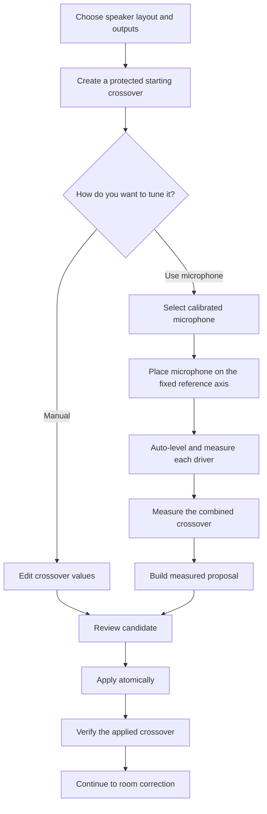

# Active Crossover Builder: product and architecture specification

> **Status: design of record.** This document owns the intended user experience,
> product states, parameter-ownership rules, and implementation boundaries for
> manually or automatically commissioning an active crossover in JTS. Low-level
> DSP and hardware-safety contracts remain canonical in
> [`HANDOFF-active-speaker-dsp.md`](HANDOFF-active-speaker-dsp.md); shared capture
> and analysis primitives remain canonical in
> [`HANDOFF-audio-measurement-core.md`](HANDOFF-audio-measurement-core.md); room
> correction's shipped operational behavior remains canonical in
> [`HANDOFF-correction.md`](HANDOFF-correction.md), while its intended product
> behavior is canonical in
> [`room-correction-information-design.md`](room-correction-information-design.md).
> Those documents should link here for crossover-builder product behavior rather
> than restating it.

> **Wave 1 implementation boundary (2026-07-13): contract-only.** JTS now has
> silent contracts for target-bound hardware research, operator-confirmed driver
> safety profiles, exact excitation admission, neutral measurement identities,
> an Active-owned commissioning lifecycle, and an exact positive eligibility
> receipt. These types have no live playback, CamillaDSP mutation, persistence,
> or automatic-receipt producer. The existing Active setup projection now emits
> a versioned Room authority that keeps manual applied-profile authority
> separate from automatic commissioning: an explicitly applied manual profile
> is eligible on the solo active runtime, while an automatic profile remains
> blocked until the later integration lane issues, persists, and exposes the
> strict receipt. Room
> consumes that one Active decision and does not inspect the underlying graph or
> evidence. Grouped active is explicitly outside this v1 authority: the leader
> program bake does not expose the driver-domain Layer A carried by Camilla #2.

> **Wave 3 lifecycle boundary (2026-07-14; hardware-free).** A
> fresh authoritative comparison set that carries a production bundle session
> id now starts one durable Active commissioning run. The control-plane store
> persists the exact session fingerprint, run id, process-owner generation,
> immutable target-attempt reservations, and a bounded, sequenced journal of
> the nine-state transitions. Correction-web claims that owner at service start,
> making prior-generation callbacks stale, and
> `/correction/crossover/status` reports its `commissioning_run` block as
> `not_started`, exact
> `current`, comparison-`stale`, or fail-closed `unavailable` state. This is
> lifecycle identity, not acoustic or apply authority. Correction-web still
> starts the run at `unconfigured`; only the typed internal evidence host below
> may reserve region-scoped attempts and advance through `protected` to
> `measured` after exact persisted evidence exists.

> **Wave 3 region-evidence boundary (2026-07-14; hardware-free).**
> `jasper.active_speaker.commissioning_evidence` now derives an immutable
> group-by-region plan from the exact typed durable-run handle, topology, preset, protected profile,
> comparison set, threshold profile, and commissioning session. Its strict pure
> values require separate normal, reverse, and delay identities for every
> crossover region (including both regions of a three-way); exactly three fresh
> one-shot stationary captures for normal and reverse; and five fresh one-shot
> captures at every coordinate of the exact Shared bounded schedule. The
> schedule keeps the exhaustive fine grid capped at 25 measurements and, when
> that grid is larger, binds at most 25 symmetric coarse coordinates plus the
> two adjacent fine coordinates around one explicit coarse refinement anchor.
> The schedule makes no winning-delay claim. Shared's separate
> `select_scheduled_delay()` final evaluator requires exact scheduled evidence
> and applies the same repeatability, plateau, and tie policy as the exhaustive
> selector without relaxing its 25-point limit. Capture
> planning requires the preset's exact group set: one mono active group for a
> mono preset, or exactly left and right active groups for a stereo preset, all
> using the preset's way-count mode and complete driver-role set. Capture
> contexts retain the typed reserved-attempt handle (including owner generation,
> attempt number, and reserved target), exact graph, placement, and both
> generation and playback protection proofs. An explicit per-region operator
> attestation supplies the signed geometry seed; even `0.0` cannot be assumed.
> A complete aggregate requires exactly one region value per plan target and
> makes artifact paths, admissions, and attempts globally unique.
>
> The Active-owned `CommissioningEvidenceHost` now makes this evidence path
> reachable behind a typed internal server boundary. It authors one deterministic
> next operation, reuses that operation's durable attempt for same-process
> retries while requiring new one-shot capture/admission identities, persists
> and reopens every capture and aggregate before progress, captures coarse
> delay evidence before deriving refinement coordinates, and runs the separate
> schedule-aware selector only after the exact schedule is complete. The joined
> runtime holds the existing writer lock through server-derived graph apply,
> admitted playback/capture, and exact graph/path/listening-volume restoration.
> Each transient graph hard-caps `devices.volume_limit` at the quieter of its
> inherited ceiling and the admitted measurement volume; playback re-admission
> freshly proves that ceiling. The capture transport's play closure expires
> when transport returns, raises, or is cancelled, so no retained callback can
> emit audio after the guarded transaction.
> The plan fingerprints the normalized applied baseline plus microphone
> calibration once for the complete program; every fresh operation must still
> match it. Normal, reverse, and every delay coordinate—including zero—must
> retain distinct live-graph identities.
> Cleanup restores the potentially louder predecessor listening volume only
> after fresh graph and path readback prove the exact predecessor; otherwise the
> attenuated measurement volume remains and recovery fails closed.
> One crash-released run-store execution mutex spans that transaction through
> canonical capture commit, so a concurrent caller cannot reinterpret a live
> restored window as restart recovery.
> Before apply, a bounded run-store sidecar points at an exact immutable
> predecessor artifact; fresh restore readback gets its own terminal artifact.
> A process restart restores a still-pending predecessor before issuing another
> operation, or durably enters `blocked_live_state_unknown` and requires an
> exact-restore transition before collection can resume.
> Internal host status reports whether a capture transport is configured,
> `hardware_capture_status=hardware_validation_required`, the current live-mutation
> state, and whether exact recovery is required; it does not imply hardware
> readiness from synthetic evidence. The polling projection reopens typed
> complete anchors and proves current program/lifecycle fingerprints without
> rehashing every child WAV; mutation, evaluator, and commit boundaries retain
> the strict full-child reopen.
> Incomplete prior owner generations are abandoned; a run-scoped complete
> artifact written before its lifecycle transition is recoverable on restart.
> **Production region-capture boundary (2026-07-15; hardware-free).** The
> Crossover page now accepts one explicit signed path-difference attestation per
> region and offers one generic next combined-capture action. The production
> relay accepts only `kind=summed`; the browser cannot supply region, polarity,
> delay, graph, attempt, ordinal, or admission. It contributes a real recorder
> WAV, the authenticated `summed_reference_axis_v1` acknowledgement, and
> non-authoritative diagnostics. The existing `CommissioningEvidenceHost`
> remains the sole sequencer and runs normal, reverse, and bounded-delay graphs
> through its existing writer/readback/restore transaction. Status never reserves
> attempts or live mutations and reports `server_selected` instead of
> reconstructing that schedule.
> Calibration and recorder identity reopen from the durable comparison set;
> completed isolated evidence may cross owner generations only for the same
> exact program, while geometry and live attempts remain generation-specific.
> Production entry is launch-gated to a two-way preset on a DAC profile that
> declares `supports_active_crossover_commissioning`; only the base DAC8x
> profile declares it today. Three-way and other DAC paths fail before capture.
> Legacy raw/direct summed routes remain refused. This slice still makes no
> candidate, apply, receipt, or Room eligibility decision, and no live hardware
> was used.
>
> **Wave 3 relay Stop boundary (2026-07-14; hardware-free).** The Crossover
> page exposes one Stop action for active relay level and sweep work through
> `/correction/crossover/relay-cancel`. While cancellation and exact cleanup are
> in flight, the server envelope reports `stopping` and withholds forward
> actions; terminal `stopped` appears only after the owning worker has drained.
> The subsequent phone-upload and persistence phases are visibly non-stoppable.
> User Stop is cancellation, not a measurement failure or failure-cue event.
> The exact boundary and operational mechanics are canonical in
> [`phone-mic-relay-plan.md`](phone-mic-relay-plan.md).

## Product goal

JTS should let a user commission an active two-way or three-way speaker in one
of two equally supported ways:

1. **Manual:** the user enters the crossover frequency, filter family and slope,
   driver trim, polarity, and relative delay they want. JTS previews, validates,
   applies, and verifies that exact crossover.
2. **Automatic:** JTS guides the user through calibrated-microphone placement,
   measures each driver independently and in combination, proposes those same
   crossover values from acoustic evidence, and applies them only after the user
   reviews an explicit before/after comparison.

The two paths must converge on the same crossover model, compiler, application
transaction, verification step, and rollback behavior. Automatic commissioning
is not a second kind of crossover and must not create a second settings store.

The feature should be powerful enough for an experienced builder to understand
and control the result, while the normal path feels like a calm sequential
setup—not a measurement laboratory. At any point the user should understand:

- what JTS needs them to do next;
- whether sound is about to play and through which driver;
- which values are manual, measured, proposed, or currently applied;
- why JTS accepted or rejected a measurement;
- what will change if they press Apply; and
- how to return to the previously working crossover.

## Product promise

The crossover builder makes four promises:

1. **Manual control is first-class.** A knowledgeable user can set the values
   directly without performing microphone measurements or invoking an AI helper.
2. **Automatic means measured.** Automatic values come from the user's current
   speaker, microphone calibration, applied test graph, and captured acoustic
   evidence—not merely driver datasheets or an LLM guess.
3. **Overwrite is explicit.** An automatic result may replace a manually tuned
   crossover, but only through an explicit comparison and confirmation. It never
   silently rewrites live settings.
4. **Room correction comes second.** Room correction may begin only after the
   driver-domain crossover is applied and its combined response has been
   verified. Room correction must not be used to disguise a broken driver
   handoff.

## Scope

### In scope

- Passive/full-range, active two-way, and active three-way layouts, with the
  existing optional-subwoofer topology represented where the runtime supports
  it.
- Manual crossover frequency, family/order, slope, trim, polarity, and delay.
- A guided calibrated-microphone flow for per-driver level, response, usable
  overlap, polarity, delay, and combined-response evidence.
- Deterministic automatic proposals for crossover values.
- Preview, explicit apply, post-apply verification, and rollback.
- Evidence and state surfaces sufficient to diagnose a failed run without
  repeating it blindly.
- A clean handoff into room correction after commissioning succeeds.

### Not in the first working release

- Automatic limiter, excursion, or thermal-model design.
- Automated high-output compression testing.
- Arbitrary optimizer plug-ins or a general-purpose loudspeaker CAD framework.
- Unbounded per-driver EQ or automatic positive-gain correction.
- Listening-preference EQ or room-response target curves; those belong to later
  DSP layers.
- An LLM directly authoring or applying live DSP. Research may suggest safe
  starting constraints, but measured deterministic code owns the proposal.

These are deliberate boundaries, not a claim that the omitted work is
unimportant. The first release must work reliably and be understandable. More
safety and analysis can be added behind the same contracts once the measurement
and application loop is proven on hardware.

## First principles

An electrical crossover setting is not the acoustic crossover the user hears.
For each driver, the acoustic result is the product of the mounted driver's
response, the electrical filter, EQ, gain, polarity, and propagation delay. The
speaker output is the complex sum of all active drivers.

Therefore a crossover is commissioned only when JTS has addressed:

1. each driver's protected and usable frequency range;
2. a crossover frequency inside a clean overlap region;
3. the **acoustic** high-pass and low-pass shapes, not only their electrical
   labels;
4. relative driver level through the handoff region;
5. polarity and relative acoustic delay;
6. the combined response with both drivers playing;
7. gross off-axis or vertical-lobing problems where the measurement tier can
   observe them; and
8. headroom for the proposed filters and trims.

A tone at one frequency is useful for setting a safe capture level. It is not
enough to design a crossover. A protected logarithmic sweep provides the
broadband magnitude and impulse evidence; separate and summed measurements
provide the handoff evidence.

## One model, three states

The existing `ActiveSpeakerPreset` vocabulary is the semantic source of truth
for crossover values. Extend that vocabulary when the product gains a real
parameter; do not introduce a parallel automatic-crossover schema.

The product has three states with different authority:

| State | Purpose | Can affect sound? |
|---|---|---:|
| **Working crossover** | The user's editable manual values or the latest reviewed automatic proposal | No |
| **Candidate** | A frozen, validated snapshot compiled from the working crossover and its evidence | No |
| **Applied crossover** | The active speaker preset confirmed by the DSP runtime | Yes |

Measurement records are evidence, not a fourth settings store. They may produce
a new working proposal, but they never become live merely because a capture
completed.

The applied crossover is authoritative for playback. The working crossover is
authoritative for the form. The candidate records exactly what would be applied.
The UI must never merge values from those states implicitly.

The source fingerprint remains the compile-cache/freshness key. A distinct
candidate identity covers the normalized preview plus the immutable
recomposition snapshot: manual frequency, family/order, derived or preserved
trim, polarity, delay, tuning owner, and playback/domain/capture context. Apply
carries the candidate identity the user reviewed. Under the shared DSP writer
lock, the backend recompiles and re-proves that identity, then re-hashes the
written config immediately before load. If working state is already candidate
B at that locked reread boundary, a request carrying reviewed candidate A is
refused and the review refreshes. Once A is re-proven, only A's exact config
hash may load; B can never load under A's confirmation.

Working crossovers and candidates are strictly silent: the crossover preview
emits no audio and no CamillaDSP YAML, may not stage or load a graph, and may
not authorize playback (enforced today by
`jasper.active_speaker.crossover_preview`'s no-audio permissions). Reviewing a
proposal must remain possible even while safety gates block staging or
playback — a blocked speaker can still show what JTS is thinking.

### Parameter provenance

Every candidate should be able to explain where each value came from:

- `manual` — entered or edited by the user;
- `measured` — derived from the current measurement session;
- `recommended_start` — a conservative starting value from driver/profile
  constraints, not yet proven acoustically; or
- `preserved` — carried unchanged from the applied crossover.

Provenance is metadata on the canonical value, not a second value. It exists so
the comparison and diagnostics can be honest.

The shipped substrate carries a narrower, per-role trim provenance
(`explicit` / `measured` / `sensitivity` / `none` in the baseline-profile
layer). Implementation migrates that vocabulary into this per-parameter one —
`sensitivity` maps to `recommended_start`, `explicit` to `manual` — rather
than running two provenance models side by side.

### Replacement semantics

- Applying a manual candidate replaces the applied crossover with the visible
  manual values.
- Running automatic commissioning produces a proposal; it does not edit the
  applied crossover.
- **Replace with measured crossover** shows every changed parameter and then
  applies the automatic candidate atomically.
- Returning to Manual after an automatic proposal edits the same working
  crossover.
- Re-running automatic commissioning creates new evidence and a new proposal;
  it does not rewrite historical evidence.
- The immediately previous applied crossover remains the rollback target.

The first release should use one all-or-nothing comparison and Apply action. A
matrix of per-field locks or optimizer weights would add complexity before a
named user need justifies it. An expert who wants a hybrid result can accept the
proposal, switch to Manual, edit it, and apply the resulting manual candidate.

## User experience

The `/sound/` surface owns speaker layout, output identity, and manual editing.
The HTTPS `/correction/crossover/` surface owns microphone permission and
acoustic commissioning. They are two views of the same working and applied
crossover, not independent wizards.

The normal experience presents one primary action at a time.

### Step 1: choose the speaker and outputs

Ask only what is needed to establish the physical topology:

- mono or stereo;
- passive, active two-way, or active three-way;
- optional subwoofer when supported;
- driver role on each physical DAC/amplifier output; and
- confirmation that the output actually feeds the named driver.

Hardware discovery supports this step but should not dominate it. The user sees
physical language such as **Woofer · Output 1**, not internal channel-map nouns.
Changing an output assignment invalidates measurement evidence tied to the old
assignment.

### Step 2: establish a protected starting crossover

Automatic commissioning cannot safely discover a tweeter's lower limit by
sending it an unrestricted sweep. Before any driver plays, JTS needs a
conservative starting graph containing:

- output routing;
- an initial crossover frequency and slope;
- driver-specific high-pass protection where required;
- conservative trims; and
- the existing test-volume bounds.

The user may enter this starting point manually or use research/profile data to
prefill the visible fields. Prefill is advice. The visible working crossover is
the source of truth, and the backend validates the resulting graph before it
can emit sound.

The existing `/sound/` research helper is the only research entry point. Its
legacy version-1 JSON remains accepted only as advisory prefill. A version-2
result must echo the exact server-authored request fingerprint plus every
physical target id, target fingerprint, role, and make/model; a mismatch or
stale request is refused. Both versions are untrusted proposals, not playback
permission. Before an
automatic isolated-driver measurement can run, every physical driver target
must have a separately versioned, explicitly confirmed safety profile bound to
the current topology target. That profile distinguishes:

- the hard minimum and maximum excitation frequencies;
- required high/low-pass protection, including cutoff and minimum slope;
- a conservative measurement band inside the hard excitation band;
- a crossover-search band inside the measurement band;
- bounded level, duration, repeat, and cooldown policy; and
- cabinet/radiator capability needed for any low-frequency reconstruction.

`usable_frequency_range_hz` is descriptive product information, not a hard
safety boundary. A filter cutoff is not a brick wall either: required filter
slope and the hard excitation edge remain separate facts. Missing, unknown,
unconfirmed, stale, or target-mismatched safety facts refuse new automatic
isolated-driver audio. They do not mute an already working normal-playback
graph merely because the newer commissioning profile has not been created.
Every profile field is visible and editable in `/sound/`; confirmation freezes
the normalized visible values, their target/value binding, code-owned policy
snapshot, unknowns, and field provenance. Any target, topology, output,
driver-style, make/model, or visible safety-value change invalidates the prior
confirmation. The profile always reports `authorizes_playback=false`: a later
adapter must still compose and freshly prove the stricter excitation and live
graph authorities.

### Step 3A: manual crossover

Manual mode exposes, per crossover region:

- crossover frequency;
- filter family and order/slope;
- lower-driver and upper-driver trim;
- polarity;
- relative delay; and
- advanced bounded driver EQ only when the existing preset/compiler supports
  it as a real product parameter.

The default view can keep polarity, delay, and advanced corrections collapsed,
but they must remain reachable. Manual does not mean unvalidated: JTS still
checks topology, driver protection, graph validity, and compiler headroom.

The main action is **Review crossover**. Saving a working form must not imply
that it is active.

### Step 3B: automatic microphone commissioning

Full automatic commissioning requires a calibrated measurement microphone or a
calibration file selected for the connected microphone. A missing calibration
may support an explicitly degraded level-only diagnostic, but it must not be
represented as phase-aware, frequency-response-accurate automatic crossover
design. The calibration curve improves frequency-response accuracy; it does not
create a shared timing reference. Timing-sensitive analysis must separately use
a synchronized capture reference or a bounded measured delay/null walk.

The flow should identify the selected microphone and calibration, then explain
one authoritative placement:

> Put the microphone on the reference axis — the tweeter axis, or the design
> axis named by the speaker profile — at the height that axis is specified
> for, approximately one metre away when the room permits. Aim it according
> to the microphone's calibration file. Keep the microphone and speaker
> completely still until all driver and combined measurements are finished.

The instruction must state the axis and height concretely, because a few
centimetres of vertical offset moves the microphone through the crossover
lobe and produces a suck-out that looks like a design problem. The post-apply
verification capture must use the same axis and height so it compares like
with like. The exact wording may be specialized by a hardware/speaker
profile, but the default automatic flow must not ask the user to move the
microphone from driver to driver: a fixed reference-axis position is what
keeps the drivers' relative summation evidence comparable across captures.
It yields timing evidence only together with the bounded measured delay/null
walk (or a synchronized capture reference); a fixed microphone alone does
not create a shared clock.

Near-field capture of a low-frequency driver is not an advanced diagnostic —
it is the standard complement to the fixed reference-axis capture. In a
domestic room the reference-axis capture is only valid above the
reflection-free window's floor (see "Measurement validity" below), so when a
crossover region sits at or below that floor, the flow requires a near-field
capture of the lower driver, applies baffle-step/diffraction correction, and
splices it to the gated reference-axis response. What remains rejected is
the old near-field-only shape: uncorrected near-field level trims presented
as far-field truth.

JTS then performs this sequence:

1. Capture ambient noise long enough to characterize non-stationary sources
   and determine whether the measurement can proceed.
2. For each driver, derive a protected level-probe band from the applied
   crossover and driver-protection edges.
3. Gradually raise that driver's measurement level within the commissioning
   envelope until the capture shows a safe, non-clipping level with
   microphone headroom. The probe sets level only; the SNR verdict comes
   from the deconvolved sweep, per band.
4. Play a protected logarithmic sweep through that driver only, with a
   driver-appropriate sweep length (longer for woofers, bounded short for
   tweeters).
5. Repeat the sweep three times without moving the microphone.
6. Reject clipped, incomplete, stale-graph, wrong-driver, or low-SNR captures.
7. Gate each accepted impulse response to its measured reflection-free window
   and record the resulting low-frequency validity floor.
8. Aggregate accepted repeats robustly and retain their spread.
9. Continue to the next driver using its own safe probe and locked level.
10. Measure all drivers in a crossover region together, first in the candidate
    polarity and then with the bounded reverse-polarity validation needed for
    alignment.
11. Produce a measured proposal and a plain-language explanation.

Three exact-position repeats are the normal crossover default. Their purpose
is outlier rejection and a variance estimate — catching the door slam, the
furnace kick, the drifted capture — not noise-floor reduction: acoustic-noise
headroom comes from the level/SNR policy, never from raising the repeat
count. Cross-repeat coherent averaging requires a shared sample clock between
playback and capture, which today's browser and USB capture paths do not
have, so analysis defaults to robust magnitude statistics while preserving
the individual complex records; coherent aggregation may be enabled only
behind a real shared-clock/loopback gate. If one of three repeats is
rejected, the flow re-captures once to restore three, or proceeds with two
and widens the reported confidence. It must never average moved microphone
positions into phase/alignment evidence.

### Level control and SNR

Auto-level is driver-specific because a woofer, midrange, and tweeter have
different safe and useful bands. Tone/probe selection remains owned by
`jasper.active_speaker.test_signal_plan`; UI or relay code must not duplicate
frequency rules.

The controller should:

- begin at the bounded quiet level;
- use a short band-limited probe or preview sweep representative of the
  driver's useful measurement band to find a safe, non-clipping capture level
  with microphone headroom — the probe owns level safety, not the SNR
  verdict;
- raise gain gradually within the existing commissioning envelope;
- choose a driver-appropriate sweep length (longer sweeps buy low-frequency
  processing gain on a woofer; tweeter sweeps stay short and protected —
  sweep length is a protected parameter of the safety floor, like level);
- retain microphone peak and clipping headroom; and
- keep a visible Stop action while sound is playing.

The SNR verdict is computed after deconvolution, per band, from the accepted
sweep against the stored ambient capture — never from the raw probe, which
cannot see the sweep's band-dependent processing gain. The ambient capture
must be long enough (or repeated) to characterize non-stationary noise, and
the noise reference uses a percentile or maximum rather than one short quiet
window.

SNR thresholds are split by decision class, band-specific, and evaluated on
the worst band the decision depends on:

- **Magnitude and trim decisions** target at least 25 dB SNR as a floor
  (prefer 40 dB or better where the room and level allow), accept 20–25 dB
  with an explicit reduced-confidence result, and stop below 20 dB with a
  report of how many decibels are missing. These tiers correspond to roughly
  ±0.5 dB and ±0.9 dB magnitude accuracy.
- **Null and alignment decisions** (reverse-polarity depth, delay-walk
  evidence) need substantially more: a null of depth D cannot be measured
  with less than about D + 10 dB of SNR in the overlap band. Alignment
  evidence therefore requires the overlap band to reach approximately
  35–40 dB SNR, or the reported null depth is capped at the measured noise
  floor and the alignment verdict degrades to "review" — never "aligned".
- The accept/reduce/refuse verdict is per band, with defined partial-pass
  semantics: a woofer run may be good from 150–800 Hz, reduced 80–150 Hz,
  and short below 80 Hz, and the proposal consumes exactly that rather than
  refusing the whole capture over its worst octave.

A 1 kHz scalar level is not sufficient evidence that a broadband room or
driver sweep has 20 dB SNR. Raising microphone gain does not fix acoustic
SNR when it raises room noise and signal equally. Low-frequency shortfall in
the woofer's bottom octave is a NORMAL outcome in evening and urban rooms —
residential noise is heavily low-frequency-weighted — so the shortfall path
is ordinary product behavior, not an error state: name the actionable lever
(quiet the room, accept reduced low-frequency confidence, or raise the level
automatically within the envelope — see the closed-loop level solver below).

**The closed-loop level solver (W2.1) chooses the sweep level automatically,
before any tone plays.** Hardware session 2026-07-16 (jts3) measured driver
sweeps running roughly 24 dB below the driver-safety effective-peak ceiling
in a noisy room — worst-band SNR 11.0-16.1 dB against the 20 dB floor above,
a deterministic "insufficient" result every time, even though every input
needed to pick a louder, still-safe level was already known before the tone
played. `jasper.audio_measurement.level_solver` closes that gap: given the
driver's level-match lock (`gain_map_db`, the ramp's dynamic `cap_db`), the
room's ambient noise (a per-band phone measurement when available, else the
ramp's broadband `noise_floor_dbfs` plus a conservative low-frequency
weighting margin — low-frequency room noise routinely reads louder than a
broadband average suggests), and the confirmed driver-safety ceilings (the
same `max_effective_peak_dbfs` admission itself enforces), it picks the
QUIETEST `(main_volume_db, commissioning_gain_db)` pair that clears the 20 dB
floor plus a 6 dB solver margin. `main_volume_db` climbs first, bounded by
the ramp's cap; `commissioning_gain_db` only rises off its current baseline
(never below it) when volume alone, at its cap, still cannot reach the
target — the case an insensitive driver (e.g. a tweeter whose role gain
already floors it well below the ceiling) needs. When even that best effort
cannot clear the bare 20 dB floor, the solver refuses with a typed
`room_too_noisy_for_safe_measurement` result BEFORE any tone plays, naming
the failing band and the two levers (quiet the room, move the microphone
closer) — the refusal itself does not invalidate the driver's level lock,
though the remedy the UI offers today re-runs the guided level check from
the start (ambient is currently a ramp byproduct; a retained-locks
re-measure is the planned seam for the phone ambient-stats follow-up).
`commissioning_gain_db` stays governed by the same non-positive,
`DriverSweepGeneratorPlan`-validated invariant as before — the solver
proposes, commissioning admission still validates every ceiling exactly as
it always has (defense in depth). The phone-side per-band `ambient_stats`
event is a follow-up page change; until it ships, every solve takes the
broadband-fallback path.

**Bounded correction (W2.2) is ONE signed per-target adjustment, applied
to the solver's assumed ambient, with up to two writes per target per
comparison set.** Hardware run 18 (2026-07-16, jts3) exposed a second
failure mode the W2.1 escalation didn't cover: a woofer sweep solved with
`gain_map_db` from the level-match ramp's single 250 Hz lock tone,
predicted a comfortably safe mic peak, and clipped the mic at 0 dBFS
anyway — a single-frequency tone can underestimate a full sweep's hottest
band by double digits of dB, and a clip rejection carries no
`snr_shortfall_db` (the W2.1 escalation's only trigger), so the same
doomed level replayed identically on every bounded repeat attempt. Two
independent, complementary fixes:

1. **SNR-shortfall rejections still raise the assumed ambient** (unchanged
   sign/mechanism), and **clip rejections now lower it** — a de-escalation
   sized from the clipped capture's OWN measured mic peak, targeting a
   `MIC_TARGET_PEAK_DBFS` of −12 dBFS (well below the −6 dBFS hard mic-clip
   ceiling) with a `CLIP_UNDERESTIMATE_ALLOWANCE_DB` of 3 dB folded in,
   since a clamped/clipped mic reading understates the true acoustic peak.
   Both triggers write into the SAME signed adjustment slot, so a
   target's correction always reflects its most recent evidence regardless
   of which direction it came from.
2. **Once ANY capture — accepted or rejected — exists for a target, the
   driver's own measured chain gain (measured mic peak minus that
   attempt's played level) replaces the tone's `gain_map_db` for the
   solver's mic-clip ceiling specifically** (not the SNR-target math, which
   still reads the tone-derived `gain_map_db` unchanged) — a full-sweep
   measurement is strictly better evidence about the driver's hottest band
   than one lock-tone frequency. When the capture that produced the
   reading clipped, the same `CLIP_UNDERESTIMATE_ALLOWANCE_DB` is folded
   into the stored gain so every later use inherits the same conservatism.

**Completion-time correction (W2.3, hardware run 19) covers a third failure
mode neither W2.1 nor W2.2 saw: a repeat set can finalize with every
individual attempt accepted — each attempt's topology-overlap region was
clean, so the per-attempt rejection path above never fires — yet the
finalized winner capture's own aggregate worst-band SNR still reads
"insufficient".** Two full woofer repeat sets at the tester's stationary
desk placement measured exactly this: all 3 attempts `accepted=true` each
time, per-attempt `snr_verdict=insufficient` (13.7/14.2/13.2 dB, then
16.3/13.4/7.8 dB after the household restarted the level check) — zero
`level_solve_corrected` events, because the correction only ever wired from
a rejection. The completion path now extracts the finalized winner's own
measured worst-band SNR and, when the aggregate verdict is insufficient,
writes a correction sized from the solver's own required threshold (the 20
dB floor plus the 6 dB solver margin, i.e. the same 26 dB the solve itself
gates on) minus what was actually measured — not the bare per-band
acceptance floor those individual bands were gated against.

At most two corrections write per target (any trigger, combined); a third
rejection or completed-insufficient finalization past the bound does not
guess a third level — the next solve attempt refuses pre-flight with a
typed `measurement_window_unreachable` result (same "fires before any tone
plays, never invalidates the level lock" contract as
`room_too_noisy_for_safe_measurement`), naming the physical lever: move
the phone closer to the driver being measured, then measure again.

**As of W2.3, the adjustment and the measured gain persist per (target,
relay microphone identity) across a fresh ramp lock — including the
between-set level-check restart, the household's only mechanical path out
of both terminals** — hardware run 19's two repeat sets measured
near-identical solve inputs before and after the household restarted the
level check (set 1 solved −26.25 dB effective, set 2 solved −27.9 dB,
quieter only because the fresh ambient baseline happened to read lower), so
clearing the correction on every re-lock or restart just replayed the same
doomed level. The two restarts are distinguished by **stored state**, never
by request shape (both terminals POST the same level-match endpoint with
the same body).

**W2.4 (hardware run 20, 2026-07-17) revised the discriminator from
"exhausted budget" to "a pre-flight refusal was shown for this target."**
Run 19's terminal state (completed-insufficient, no pre-flight solve ever
refused) and W2.2's exhausted-budget refusal are not the only way a
household reaches the between-set restart: run 20 showed set 1 finalizing
insufficient (writing a +shortfall correction, one write — not exhausted),
set 2 solving louder from that correction, and THEN genuinely refusing
`room_too_noisy_for_safe_measurement` before any tone played — still one
write below the exhausted bound. The household followed the refusal
screen's own "Redo the quick level check" action, relocked both drivers
cleanly, and tapped measure — and the identical refusal came back in about
5 seconds, no pre-roll, no tone: the old "not exhausted → preserve" rule
kept the SAME adjustment in place across the restart, so the fresh solve
against a freshly re-measured (near-identical) room reproduced the exact
same refusal. An honest instruction ("redo the level check to measure
again") led to a dead loop, because nothing about the correction had
changed to make the next solve different — the correction and the
refusal it produced disagreed about whether the household's own new
attempt was new evidence.

The revised rule:

- a target with **no pre-flight refusal pending** keeps its signed
  adjustment, write count, measured gain, and mic-identity binding across
  the restart — this is the completed-insufficient path (every individual
  attempt accepted; the aggregate SNR verdict alone triggered the
  correction) and is what makes that terminal's "JTS will play the next
  measurement louder" promise come true;
- a target with **a pre-flight refusal pending** — either a genuine
  `room_too_noisy_for_safe_measurement` solve refusal at ANY write count,
  or the synthesized `measurement_window_unreachable` refusal once the
  budget is exhausted (exhausted is always a refusal; it is subsumed, not
  a separate case) — clears completely on the restart: a fresh evaluation,
  so the refusal cannot latch, and if the physics truly didn't change the
  machinery re-converges to the refusal within the bounded write budget
  instead of looping on one identical solve with no audio ever played.
  Every restart after a refusal now plays a real baseline sweep and
  re-measures reality — the household relocking cleanly is itself new
  evidence the solver had never seen — which converges or honestly
  oscillates with real measurements, never a canned replay.

Both surfaces read the same two stored facts — the lease's most recent
pre-flight solve refusal (`_solve_refusal`) and the bounded-correction
write count (`_correction_budget_exhausted`) — through separate readers:
the between-set restart via `CrossoverLevelLease._target_refusal_pending`
(direct reads), the envelope's refusal rendering via
`level_match_snapshot()`'s `solve_refusal` / `solve_correction.exhausted`
projections of those same facts
(`crossover_envelope._active_level_solve_refusal`). Because the readers
are separate code paths, their agreement about "was a refusal shown for
this target" is pinned by a parity regression
(`test_refusal_pending_predicate_parity_with_envelope_rendering`) across
the representative states (refusal pending below the bound, exhausted
without a fresh solve refusal, neither) rather than assumed
structurally.

Beyond the refusal-pending restart case, a target's correction state
clears only on: its repeat set finalizing with a *sufficient* aggregate
verdict, the relay microphone changing (a different mic is different
physics), or a true full reset (`invalidate_comparison_context` without
the between-set-restart flag — no production surface calls this today; it
is the contract for any future whole-flow reset). It never clears on a
terminal refusal (insufficient accepted repeats), since that failure
mode's physical cause is very likely still present on the next attempt.
`measurement.level_solved` carries the signed `adjustment_db` (the
persisted running total, so it reflects every prior write across re-locks
and restarts) and a `gain_source` of `tone_gain_map` or
`measured_band_peak` so the journal names which evidence a solve actually
used; `correction.crossover_level_context_invalidated` names the preserved
and cleared (`cleared_refused_targets`) targets on every between-set
restart.

The household-facing copy for a level-solve refusal is one code → sentence
mapping (`describe_level_solve_refusal`, in
`jasper.active_speaker.crossover_envelope`), and the raise site
(`LevelSolveRefused` in `jasper.web.correction_crossover_backend`) builds
its own `str(exc)` from that SAME mapping — mirroring
`jasper.correction.level_match.LevelMatchRefused` — so a caller that only
does `str(exc)` (the phone's `sweep_failed` host event, the wizard's
generic relay-failure fallback) can never render the raw
`"level_solve_refused code=... band=...Hz"` diagnostic string to the
household; both surfaces showed exactly that string, in red, before this
fix. The envelope also no longer renders the generic
`crossover_repeat_rejected` nudge (built from the durable repeat ledger's
last-result entry, independent of the eventual screen) alongside the
`level_solve_refused` screen — that nudge's "nothing to fix in the room,
try again" copy flatly contradicted the refusal's own verdict.

**The per-band noise estimate must match measured reality (phantom
noise-floor fix, hardware forensics 2026-07-17).** W2.1-W2.3 above were all
built on an unquestioned input: the per-band SNR the ambient-noise
deconvolution reported. Forensics on three real jts3 captures (sessions
293cc36331f7, 70819cab996b, f44ecc33d071 — driver=main woofer, sweep
f1=60 Hz/f2=4000 Hz) found that input itself was wrong. `sub_bass` (20-80
Hz) straddles the sweep's own `f1` — the reference carries almost no
deliberate energy there — so the regularized deconvolution
(`jasper.audio_measurement.deconv.regularized_deconvolution_full`, a fixed,
frequency-independent Tikhonov epsilon) was dividing by a near-zero
reference spectrum: a well-known "resonance" artifact of that kind of
regularization, not a measurement. Independent FFT analysis of the same raw
quiet windows put the room's true `sub_bass` ambient at about −75 dBFS,
stable across all three sessions; the deconvolved noise term the estimator
reported was about −25 dBFS — **the reported per-band SNR was overstated by
roughly 40-50 dB.** Every "insufficient" verdict W2.1's escalation, W2.2's
clip correction, and W2.3's completion-time correction were built to react
to — across the runs 1-20 correction/refusal cascade this section
documents — was chasing that phantom, not real room noise: true `sub_bass`
SNR was roughly 63-66 dB, comfortably "ok".

Fix: `jasper.audio_measurement.snr_policy.excitation_covered_bands` flags
any canonical band not ENTIRELY inside the reference sweep's `[f1, f2]`
(no margin — widening the check to "give the fade some berth" would also
flag bands that read fine today, trading a real bug for an unforced
regression). `apply_noise_band_fallback` substitutes the raw
(non-deconvolved) robust ambient reading — grounded truth for what the room
actually did, already computed for the small robust-minus-baseline
non-stationarity delta but previously unused for gating — for exactly those
uncovered bands, UNLESS that raw reading is itself floor-clamped at
`snr_policy.DBFS_FLOOR` (no real precision left to trust either; the real
hardware `treble` shape, entirely above a woofer's `f2=4000 Hz`, where the
phone mic's own noise floor at 4-12 kHz reads as pure digital silence — that
band keeps its pre-fix deconvolved value rather than reporting a clamped
number as a real measurement). Covered bands (bass/upper_bass/transition/mid
in the real captures, and every band on the DEFAULT 20 Hz-20 kHz
single-driver sweep) keep their reported level unchanged — the fix only adds
the additive diagnostic `basis` key (`"deconvolved"` vs
`"raw_ambient_fallback"`) each band entry now carries.
This is scoped to the noise TERM only: the signal-side magnitude
computation, the verdict vocabulary, and every consumer of the SNR block
(`band_snr_verdicts`, `worst_band_verdict`, the W2.1-W2.3 completion-
correction machinery above) are unchanged — their inputs simply became
truthful. Ground-truth fixtures (compact per-band numeric tables, not WAV
blobs) and the synthetic protective-power cases (a genuinely noisy quiet
window must still read "insufficient") are pinned in
`tests/test_audio_measurement_snr_policy.py` and
`tests/test_active_speaker_driver_acoustics.py`.

### Measurement validity: gating and the low-frequency floor

A domestic room contaminates a far-field capture with reflections a few
milliseconds after the direct sound. Analysis must therefore gate: detect the
first strong reflection in each accepted impulse response, window the
response to the reflection-free span, and record the resulting low-frequency
validity floor (approximately the reciprocal of the window length — a 4 ms
window resolves nothing below roughly 250 Hz). At one metre in a typical
room the floor lands near 215–285 Hz, set by the floor bounce.

The validity floor is a first-class result, reported with the same honesty
as SNR:

- every derived quantity (level, magnitude shape, polarity, delay, proposal
  scoring) is computed only from data above the floor;
- when a crossover region sits at or below the floor, the reference-axis
  capture alone cannot decide it — the flow requires the near-field capture
  plus baffle-step correction and splice described in Step 3B, and says so;
- the review screen and evidence bundle record the achieved window, the
  floor, and whether each proposed crossover frequency sits above it; and
- a proposal whose frequency the room prevented measuring is marked
  reduced-confidence or refused with "the room prevented a low-frequency
  decision here", never silently emitted.

#### Low-frequency reconstruction contract: sealed single radiator v1

The first reconstruction success path is deliberately narrower than the
ordinary `near_field` capture label. That label and its placement proof are
useful for repeat identity and level diagnostics, but they attest an operator
instruction rather than a measured microphone distance. They are not by
themselves reconstruction evidence.

`sealed_single_radiator_v1` is the only admitted cabinet model. It requires all
of the following immutable, positive geometry:

- `enclosure_kind = sealed` and `radiator_count = 1`, with no port, passive
  radiator, coupled second cone, or other acoustic source;
- effective circular radiating diameter `D`, front-baffle width `w`, and
  front-baffle height `h`, all in millimetres;
- a near-field microphone distance `r_nf`, measured from the diaphragm/dust-cap
  centre to the microphone capsule; and
- a reference-axis distance `r_ff`, measured from the baffle plane to the
  microphone capsule, and a known reflection-free validity floor, using the
  same microphone/calibration identity and immutable applied crossover as the
  near-field capture.

The frozen version-1 safety profile remains the authority for enclosure kind,
source count, effective diameter, and baffle width; it is not silently extended
with baffle height. Height lives in a separately versioned, operator-confirmed
`jts_active_speaker_reconstruction_geometry` artifact bound to the exact target
id/fingerprint, topology fingerprint, and confirmed safety-profile
fingerprint. Both distances live in immutable
`jts_active_speaker_reconstruction_placement_proof` artifacts bound to their
exact capture identity and the same context. They are numeric ruler
measurements entered by the operator, not sensor claims. The current
operator-attestation placement proof and its nominal 3 cm instruction cannot
be reinterpreted or upgraded into either artifact.

The model uses `a = D/2`, metres for the equations below, and `c = 343 m/s`.
The near-field sample is valid only when `0 < r_nf < a/20`; the far-field
sample is valid only when `r_ff > 6a`; and reconstructed near-field bins stop
at `ka = 2πfa/c <= 0.8`. The distance rules follow the conservative ARTA
free-field reconstruction procedure; the `ka <= 0.8` product threshold keeps
a 20% margin inside Keele's low-frequency piston condition `ka < 1`. An
operator acknowledgement without the persisted numeric ruler value, a nominal
instruction, a driver model's frame diameter, or an inferred phone dimension
never substitutes for a measurement.

The selected cabinet correction is ARTA's rectangular-baffle low-frequency
diffraction approximation. Define the square-equivalent baffle dimension

`d_eq = w (h/w)^(1/3)`

and `f0 = 34.16/d_eq` with metres and hertz. Convert the half-space near-field
response to an on-axis full-space magnitude estimate with

`B_db(f) = 20 log10 |(1 + j f/f0) / (2 + j f/f0)|`.

This is a broad 4π-to-2π baffle-step model: its magnitude approaches -6 dB at
low frequency and 0 dB at high frequency. It is not an edge-diffraction-ripple,
off-axis, directivity, or arbitrary-box simulator. No fitted frequency-shaped
correction may be learned from the overlap. A different enclosure/source shape
needs its own reviewed reconstruction contract rather than a permissive flag.
The spliced product is magnitude evidence only. It cannot supply relative
phase, polarity, delay-walk, reverse-null, or shared-clock evidence; those stay
separate prerequisites for candidate evaluation. Do not synthesize the model's
complex phase. The later scalar overlap alignment subsumes absolute
near-to-far distance scaling. The ARTA approximation is admitted only in its
stated source-size domain, `1/40 <= (a/d_eq)^2 <= 1/10`.

Splicing is deterministic and fail closed:

1. Let `L` be the greatest of `1.25 * f_valid_floor` and both responses' lower
   support bounds. Let `U` be the least of the near-field `ka = 0.8` limit and
   both responses' upper support bounds. Refuse unless `U/L >= 2`.
2. Select exactly one octave: `f_lo = min(max(f0, L), U/2)`, `f_hi = 2 f_lo`.
   Refuse unless its overlap with the model transition `[f0, 2f0]` spans at
   least 1/12 octave:
   `log2(min(f_hi, 2f0) / max(f_lo, f0)) >= 1/12`. Resample both calibrated
   responses at exactly the 13 points
   `f_i = f_lo * 2^(i/12)`, for integer `i` from 0 through 12. Missing or
   non-finite coverage is not extrapolated.
3. Add `B_db` to the near-field level, then align it to the far-field
   response with exactly one scalar: the median far-field-minus-corrected-
   near-field level over the overlap. Do not peak-normalize either response.
4. After scalar alignment, refuse unless the overlap residual has RMS no more
   than 1.5 dB, maximum absolute error no more than 3.0 dB, and absolute
   ordinary-least-squares slope against `log2(f)` no more than 1.5 dB/octave.
   These are admission thresholds, not optimizer penalties. Both captures must
   also carry affirmative admission/quality verdicts and at least 25 dB
   magnitude-decision SNR throughout the selected octave.
5. Blend level in dB across the complete overlap with
   `x = log(f/f_lo) / log(f_hi/f_lo)` and
   `w(x) = (1 - cos(πx))/2`: corrected near field has weight `1-w`, gated far
   field has weight `w`. Below the overlap use corrected near field; above it
   use gated far field. Preserve the source identities, scalar offset, model
   version, bounds, residuals, and thresholds in the replay result.

A successful reconstruction serializes these labels exactly:

- `model_id = sealed_single_radiator_v1`;
- `response_domain = magnitude_db_only`;
- `amplitude_reference = played_excitation_normalized`;
- `peak_normalized = false`;
- `active_electrical_crossover_included = true`;
- `natural_driver_plant_isolated = false`;
- `phase_available = false`;
- `authority = admitted`; and
- `threshold_set_id = sealed_single_radiator_v1`.

The result fingerprint covers those labels plus the numeric thresholds and
input identities. `authority = admitted` is limited to the reconstructed
magnitude evidence and does not confer candidate, apply, verification, receipt,
or playback authority.

The reconstruction capability exposes stable typed refusal slugs:

- `reconstruction_profile_unconfirmed`, `reconstruction_profile_stale`,
  `reconstruction_target_mismatch`, `reconstruction_topology_mismatch`,
  `reconstruction_geometry_binding_mismatch`,
  `reconstruction_placement_binding_mismatch`,
  `reconstruction_applied_crossover_mismatch`, and
  `reconstruction_calibration_mismatch`;
- `reconstruction_capture_not_admitted`,
  `reconstruction_capture_quality_refused`, and
  `reconstruction_capture_snr_insufficient`;
- `reconstruction_enclosure_unsupported`,
  `reconstruction_source_count_unsupported`, `reconstruction_geometry_missing`,
  and `reconstruction_geometry_model_domain_unsupported`;
- `reconstruction_near_field_distance_missing`,
  `reconstruction_near_field_distance_out_of_range`,
  `reconstruction_far_field_distance_missing`, and
  `reconstruction_far_field_distance_out_of_range`;
- `reconstruction_far_field_validity_floor_unknown`,
  `reconstruction_overlap_missing`, `reconstruction_overlap_too_narrow`,
  `reconstruction_overlap_transition_uncovered`, and
  `reconstruction_overlap_non_finite`;
- `reconstruction_overlap_rms_exceeded`,
  `reconstruction_overlap_peak_exceeded`,
  `reconstruction_overlap_slope_exceeded`, and
  `reconstruction_decision_band_uncovered`.

A candidate decision that needs reconstructed lower-driver data must have
continuous admitted coverage across its complete `[Fc/2, 2Fc]` scoring band.
A refusal never falls back to an uncorrected near-field curve.

Wave 2's historical B2b captures are permanently non-admitted legacy
replay/debugging evidence. A strict replay may replay the exact current applied
winner from its immutable WAV, excitation, calibration snapshot,
placement proof, and applied crossover, normalizing only the declared scalar
playback gain. That replay must say `authoritative = false`, must not synthesize
the missing measured-distance or admission evidence, and cannot authorize a
splice, candidate, apply, verification, or eligibility receipt. Synthetic
fully admitted fixtures may exercise a pure candidate evaluator, but they do
not change current product readiness: until real captures satisfy every gate,
`ready = false`, no automatic candidate is persisted, and the UI does not
offer **Replace with measured crossover**.

Wave 2 deliberately stopped before implementing a score. Its typed input contract
pins the prerequisites that must precede any future frequency/family evaluation:
three distinct admitted stationary captures per required driver/normal/reverse
target, five distinct admitted null captures per graph-confirmed delay, a
50–100 µs walk bounded by declared geometry ± half a crossover period, and a
profile intersection tightened by measured per-band validity and SNR. Placement
is stable per topology-derived speaker group, not falsely global across stereo
cabinets. The future graph proof is topology-wide and exact: routing, complete
filter chains, gains, permanent protection, and `devices.volume_limit <= 0` all
belong to the same proof. Fresh persisted admission must be issued from Active's
exact current safety plan and independently rechecked by the playback backend.
The first Wave 3 production slice adopts those Shared boundaries for an
**isolated driver capture only**. `active_speaker.commissioning_admission`
turns the former preparation-only plan into the trusted adapter: it intersects
the code and confirmed-profile frequency/level/duration/repeat limits, binds the
exact current topology, applied profile, comparison session, volume lock, and
fresh running-graph fingerprint, then proves the required directional filters,
per-output limiter, exact admitted per-output commissioning gain, capture route,
audible/mute mask, headroom, and a `devices.volume_limit` no higher than the
locked listening volume from a non-best-effort CamillaDSP readback. That
transient ceiling makes the output envelope independent of a racing dial or
control-process main-volume write; a fresh post-play volume read rejects any
remaining quieter drift without issuing capture authority. The profile's
minimum cooldown is enforced as a cancellation-safe pre-play wait on every
one-shot attempt; values above the bounded five-second automatic ceiling are
refused rather than clipped. That ceiling is derived from the phone relay's
armed-to-sweep deadline after reserving the controlled ambient interval, the
longest protected sweep, and nine seconds for graph/relay operations. The
browser cannot supply protection or capture-admission authority.

Every fresh commissioning bundle is created once as the exact Shared admission
authority. Existing directories without its marker remain historical and the
reopen path never repairs or upgrades them. Each driver attempt mints a unique
`admission_id`, persists generation admission before allocating PCM, writes one
no-replace role-bounded WAV, and binds its exact bytes. Active holds one bounded
Shared DSP-writer lock across transient graph load, both live readbacks,
`play_admitted_wav()`, fan-in cleanup, and production-graph restoration. The
playback issuer rebuilds the current plan and protection evidence under that
same lock, so profile, topology, comparison, applied-profile, pre/post volume, graph,
filter, route, or target drift refuses before audio. A persisted playback-role
artifact—not the generation decision—is threaded through the server-side relay
flow and revalidated before capture persistence. Cancellation cannot bypass
restoration; after playback admission has persisted, timeout, cancellation, or
failure returns typed possible-audio authority and consumes the one-shot
identity.

Positive schema-v2 receipt validation treats every post-apply raw,
analysis-input, quality, generation-admission, and playback-admission identity
and relative path as one global namespace across all required speaker groups.
Cross-target reuse is refused even when a colliding raw path names different
bytes.

The isolated-driver playback slice does **not** make the candidate ready.
The production fixed-axis relay does now populate the strict isolated-driver
side of the plan: every accepted real recorder WAV retains its unique issued
live-graph proof, generation/playback admissions, calibration, gated analysis,
quality decision, and durable semantic attempt. Exactly three accepted repeats
complete one driver; only exact coverage of every planned physical driver
publishes `CompleteIsolatedDriverEvidence`. The bounded fourth attempt refuses
below three accepted fixed-axis captures, and status idempotently finishes
derived driver/run anchors left incomplete after typed capture publication.
Historical and fail-soft records remain forensic and non-promotable.
The later Wave 3 control-plane integration now starts and exposes a durable
`unconfigured` commissioning run only from the fresh bundle-backed comparison
set, claims its process owner at correction-web startup, and classifies a
different active comparison as stale. The isolated-driver browser route now
owns exact per-driver attempts and the first `protected` transition; summed
collection now uses that same host through a recorder-only relay. The typed internal
evidence host now reserves deterministic region attempts, persists and reopens
exact admitted normal/reverse/delay sets, evaluates the bounded measured delay
schedule, and advances the exact run from `unconfigured` through `protected`
to `measured`. A store-backed pure deterministic evaluator can now reopen exact
complete isolated and summed evidence and derive an
attenuation/polarity/delay-only electrical candidate. The production Active
service now invokes it after the final summed capture, persists and strictly
reopens one generation-scoped candidate, and advances the exact run to
`candidate_ready` with the artifact identity as transition evidence. The
correction envelope projects one server-owned review containing retained
Fc/family/order, measured per-role attenuation and absolute delay, retained
polarity proof, and exact isolated/summed provenance. Graph mutation/apply,
verification/receipt, and Room authority were not part of that candidate slice.
If the deterministic evaluator refuses otherwise complete evidence, Active
persists a generation-scoped refusal artifact and binds it to the lifecycle's
existing `candidate_scoring_failed` blocked transition. The browser offers one
fresh full measurement run; it does not retry immutable evidence that must
produce the same refusal.
Legacy direct browser/raw combined-capture routes remain permanently pre-audio
refused with `active_summed_persisted_admission_unavailable`. The production
relay's recorder-only `kind=summed` branch now supplies real WAVs and explicit
signed/fixed-axis geometry to the typed internal host without granting the
browser scheduling or DSP authority. Historical B2b captures remain
permanently non-admitted. Current projections expose only the exact measured
candidate review and the apply/recovery states described below. Automatic Room
authority remains unavailable until the retained graph passes three admitted
post-apply fixed-axis captures and Active persists the exact receipt. That gate
is separate from the operator-owned, explicitly applied manual-profile Room path
described below.

The production measured-candidate apply boundary is now wired hardware-free.
The review's explicit Apply action posts the exact candidate fingerprint; the
Active service reopens that candidate and its current target/safety authority,
then rechecks all of it inside the existing DSP writer lock. The baseline
compiler retains the reviewed preset exactly and emits only the candidate's
attenuation, normal/reverse polarity result, and playback-clock delay. Apply
uses the existing loader/readback/rollback path plus Active's exact
graph/path/listening-volume snapshot. A freshly classified protected graph and
write-once applied proof resolve the run sidecar as `retained`; only then may
the applied Layer-A snapshot and `applied_unverified` transition finalize.
Before that point any failure or cancellation restores the exact predecessor
before writer-lock release. Crash windows resume from the same sidecar and
artifacts as either pre-mutation release, exact restore, or bookkeeping-only
retained finalization. The browser projects one current state and action; it
does not reproduce the apply state machine. No live JTS3 graph was mutated by
this implementation slice.

### Wave 2 level-run correlation and timeout boundary

`jasper.active_speaker.crossover_level_run` owns schema-v1 identity and durable
progress for crossover level checks. This state is deliberately separate from
the durable listening-volume safety latch. Run correlation answers *which exact
request is this callback about?*; the volume latch remains the only authority
for exact restore or emergency attenuation after a possible volume mutation.
Neither state may stand in for the other.

Before relay transport opens, Active freezes one
`jts_active_crossover_level_run_request` containing the exact topology id,
confirmed protected-profile fingerprint, physical target id and fingerprint,
canonical capture geometry, and the complete replayable `MeasurementRamp`
configuration. The request and ramp config each have a canonical SHA-256
fingerprint. The Pi safety timeout is `ceil(ramp.safety_timeout * 1000)`; the
phone hard timeout is
`ceil((ramp.safety_timeout + 30 seconds transport/setup grace) * 1000)`. The
30-second grace is a conservative hardware-unverified Wave 2 value, not a
measured latency claim; Wave 4 must test the real phone/relay tail. Planning and
execution consume that same serialized ramp config. A changed environment after
claim cannot silently change the executing ramp.

The durable current-run phases are exactly `awaiting_phone`, `running`,
`succeeded`, `failed`, and `interrupted`. One atomic claim mints the run id; that
same id is the existing token-scoped relay `run_token`. An identical active
request returns `duplicate_active`; an identical current success returns
`duplicate_succeeded` only while the same service owner still holds the
process-local level result; invalidating the comparison context or discarding
that exact driver result removes the in-memory success marker, so the next
identical claim is new. Neither duplicate disposition may dispatch transport or
backend work. A different request cannot replace active work. Backend start is
also single flight. Only exact-current-run callbacks may mutate state; stale
terminal callbacks are ignored. At service startup, a nonterminal prior-owner
run becomes
`interrupted/service_restarted` before any retry may claim the slot. A prior
owner's terminal success does not deduplicate because the corresponding level
lock is process-local and must be reacquired after restart.

A token-matched armed batch advances the run to `running`. A token-matched
`phone_timeout` **before** backend start terminally refuses the run as
`failed/phone_aborted`: the live phone feed and clip guard have ended, so audio
must not start. A timeout recorded **after** backend start is an observation, not
premature proof of backend failure: the same already-bounded action may still
complete its final persistence. If that exact run later succeeds, it is stored
as `late_success=true`. The relay poll may observe an already-posted same-token
timeout just after success persistence; that exact-current-owner callback may
annotate the terminal success as late, but never reopens or redispatches it.
Unrelated or stale success cannot be relabeled. Success is allowed only after
both token-matched phone arming and single-flight backend start, and only after
the complete crossover action—including level-lock or comparison-set
finalization—has returned. Ordinary action exceptions become a typed terminal
failure at the adapter. The durable file and public status retain no tap link,
pull token, relay credential, raw phone events, or calibration payload;
`/state.level_match.run` exposes only safe bindings, timing fields, phase,
timeout observations, terminal reason, late-success status, and whether the
same process still holds the result needed for terminal deduplication.

The required Room-owned `correction_setup.py` transport adapter is intentionally
not part of Active's Wave 2 changes. Its exact integration is:

1. after the existing current topology/profile/target validation, call
   `CrossoverLevelLease.claim_level_match_run`; bind Room's process-local relay
   holder to both kind `level_ramp:crossover` and `claim.run_id`; if
   `should_dispatch` is false, return the existing run/status plus a tap link
   only when **both** those values match, without calling `_run_relay_capture`
   (the existing kind-prefix-only lookup is insufficient and must not return a
   prior same-kind run's link);
2. pass `claim.run_id` to `build_level_ramp_spec` as `run_token` and
   `claim.phone_hard_timeout_ms` as `hard_timeout_ms`; also pass the same id
   explicitly through `_run_relay_level_match(..., level_run_id=claim.run_id)`
   to `CrossoverLevelLease.run_level_match`; the Active lease never infers
   claimed authority from public status, and any explicit stale/mismatched id
   refuses instead of falling back to current environment config;
3. while polling, notify `mark_level_run_phone_armed` once for the matching armed
   batch and `mark_level_run_phone_timeout` only when the matching batch's abort
   reason is `phone_timeout`;
4. call `mark_level_run_succeeded` only after the complete `_run` callback and
   its lock/comparison-set persistence return; call `mark_level_run_failed` for
   ordinary exceptions, including foreground relay registration failure, before
   re-raising, using the matching `CrossoverLevelRunFailure` member
   (`RELAY_REGISTRATION_FAILED`, `PHONE_ABORTED`,
   `LEVEL_MATCH_ACTION_FAILED`, or `FINALIZATION_FAILED`); and
5. call `correction_crossover_backend.claim_level_run_owner()` beside the
   existing repeat-admission owner claim at correction-web service startup.

`_run_relay_capture`, relay credentials, capture-page lifecycle, and the generic
phone transport remain Room-owned. Active supplies only the narrow claim,
notification, terminal, status, and frozen-config consumer APIs.

Single-position capture also cannot observe vertical lobing: off-axis and
directivity behavior are outside the single-position tier's evidence (First
principles item 7 applies only where the measurement tier can observe it).
An optional vertical fan capture (roughly ±15–30°) is the smallest set that
can reveal a crossover lobe and may be offered as a deliberate extra step;
the automatic proposal treats it as a veto input when present (see "Building
the automatic proposal").

### Building the automatic proposal

Automatic design should be deterministic and bounded. It selects the best
supported **electrical** filter candidate — it does not claim to synthesize
a textbook acoustic target. Without per-driver EQ (out of scope for the
first release), a real driver's baffle step, breakup, and natural rolloff
mean an electrical Linkwitz–Riley does not produce an acoustic
Linkwitz–Riley; credible active-crossover practice treats driver
linearization as a prerequisite of acoustic-target design. The honest
first-release deliverable is therefore the best electrical
family/order/frequency plus trim, polarity, and delay, scored on the
measured summed response, and presented as a suggested starting point the
user reviews.

The proposal considers:

1. a measured usable overlap range in which both drivers are present,
   sufficiently clean, and above the low-frequency validity floor;
2. crossover frequencies inside that range;
3. the electrical filter families/orders already supported by
   `ActiveSpeakerPreset`, defaulting to even-order Linkwitz–Riley; an
   odd-order or asymmetric candidate may not be chosen on single-axis
   evidence alone — it requires off-axis (vertical-fan) evidence acting as a
   tie-breaker or veto;
4. relative trim across the overlap, not unrelated single-frequency levels;
5. polarity and relative delay that produce stable summation — a measured
   delay value from the bounded delay walk is a prerequisite for any
   automatic frequency/family choice, because lobe and null reasoning is
   untrustworthy without it;
6. combined-response deviation around the crossover;
7. reverse-polarity null quality where applicable;
8. bounded filter/headroom cost; and
9. off-axis evidence as a veto, when the user deliberately captures it.

When the measured overlap shows a driver that cannot blend without shaping —
a baffle-step-dominated region, breakup, or a steep natural-rolloff
mismatch — the proposal refuses with "this pairing needs per-driver EQ,
which the builder does not yet design" rather than emitting a confident but
unrealizable filter. The score is labeled **on-axis blend quality (single
fixed axis)** in the review screen and evidence bundle, so a good number is
not mistaken for a verdict on the whole polar behavior.

The first complete implementation does not need an open-ended optimizer. A
small deterministic candidate search over the filter families already supported
by `ActiveSpeakerPreset`, followed by measured summed verification, is easier to
test and explain.

### Step 4: review

Manual and automatic modes converge on the same review screen. It shows:

- current applied values;
- proposed values;
- provenance for each proposed value;
- the measured usable overlap;
- per-driver repeatability and SNR;
- separate-driver and combined-response plots;
- the reason a frequency, slope, trim, polarity, and delay were chosen; and
- warnings that reduce confidence without being safety blockers.

Primary actions:

- **Apply manual crossover**, or
- **Replace with measured crossover**.

Secondary actions:

- **Back to edit**;
- **Measure again**; and
- **Keep current crossover**.

The comparison must make it impossible to mistake a proposal for the live DSP.

### Step 5: apply and verify

Apply uses the existing shared DSP transaction. It must:

1. freeze the candidate and applied-profile fingerprint;
2. compile through the single active-speaker compiler;
3. validate the emitted graph;
4. retain the previous known-good profile;
5. switch atomically;
6. confirm that the runtime loaded the expected graph; and
7. roll back if compilation, loading, or runtime confirmation fails.

Wave 1 did not add a generic graph-transaction framework. The exact rollback
state identity reuses the existing
`jasper.audio_measurement.null_walk.DspPredecessor` JSON/fingerprint convention.
Holding the live writer lock,
applying, reading back, and restoring that exact predecessor remain the owning
Active adapter's later integration work.

After apply, JTS measures the combined crossover again at the same fixed
reference position (same axis and height as the commissioning captures).
Verification compares like with like and records the result
against the applied profile fingerprint. A failed acoustic verification does
not silently declare success; the user can restore the previous crossover or
return to edit/measure.

If JTS cannot confirm restoration of the listening volume after any crossover
measurement, the crossover flow fails closed: playback, capture, and apply are
replaced by one recovery action until fresh DSP readback confirms either the
exact prior level or the bounded emergency attenuation.

Once the crossover is applied and verified, the UI offers **Continue to room
correction**. Room correction then defaults to six distinct listening-area
positions. Those room positions are spatial samples and are intentionally
different from the stationary repeats used for crossover commissioning.

## Architecture and ownership

Each concern has one owner. The browser orchestrates user intent; it does not
become an acoustics engine.

| Concern | Owner | Must not own |
|---|---|---|
| Editable and applied crossover semantics | `jasper.active_speaker` preset/profile models | Browser-only settings or relay state |
| Research proposal and confirmed driver-safety profile | `jasper.active_speaker` | Applying DSP, authorizing audio, or hiding imported values from operator review |
| Safe driver probe/sweep plan | `jasper.active_speaker.test_signal_plan` and graph-safety policy | Page-specific frequency branches |
| Pure excitation-admission decision | `jasper.audio_measurement` | Speaker topology, research parsing, live DSP mutation, or product sequencing |
| Sweep generation, deconvolution, calibration, quality math | `jasper.audio_measurement` | Product sequencing or profile application |
| Driver, overlap, summed-response, and alignment analysis | `jasper.active_speaker.driver_acoustics` / alignment modules | HTTP, relay transport, or live DSP mutation |
| Durable commissioning run and evidence identity | Active-speaker measurement/session layer | Filter compilation |
| Candidate derivation and provenance | Active-speaker baseline/candidate layer | Playback side effects |
| Sequential product envelope | `jasper.web.correction_crossover_*` | Acoustics math or duplicated state machine in JavaScript |
| Phone/browser capture transport | Jasper capture relay | Tone selection, analysis, or product policy |
| CamillaDSP emission | Existing active-speaker compiler | Inferring measurements or user intent |
| Atomic apply and rollback | Shared DSP transaction/runtime boundary | Editing working drafts |
| Verified active-crossover eligibility receipt | `jasper.active_speaker` | Room-owned inference or relabeling of crossover state |
| Room correction | `jasper.correction` | Driver-domain crossover repair |

### Hardware research and confirmed safety profile

The existing `jts_active_crossover_driver_research` packet evolves in place; do
not create a parallel Room-owned research wizard or let an LLM write a live
graph. JTS binds a research request to the current physical target identities,
the returned packet echoes those identities and uses explicit unknowns, and the
server strictly validates it. Every safety-relevant value is visible and
editable. Confirmation freezes the normalized values and their field-level
provenance into an immutable fingerprint; any topology/output assignment or
value change requires confirmation again.

The version distinction is intentional: version 1 is legacy advisory research;
version 2 is bound to a current server request. Neither is authority. The
confirmed `jts_active_speaker_driver_safety_profile` is also distinct from the
older code-owned `driver_protection_profile` tone/ramp envelope and from
`/sound/active-speaker/channel-protection`'s physical/software-guard fact. Later
playback must satisfy all applicable layers; none may be relabeled as another.

A tweeter's declared `driver_style` (dome, AMT, planar, ribbon, compression
driver, supertweeter) sets `driver_protection_profile`'s minimum protective
high-pass floor — 2000 Hz for a compression driver versus the 5000 Hz
conservative default for an undeclared/unrecognised style. `driver_style` is
topology-owned, not part of the research/manual-settings schema: it lives on
`SpeakerChannel` next to `physical_output_index`, set on the layout step's DAC
output card (tweeter roles only) and saved through the existing
`/output-topology` writer, the same one that owns every other topology field.
`build_driver_safety_profile` reads it straight off the topology channel, so
it folds into the safety profile's confirmation fingerprint automatically —
changing it invalidates a prior `operator_reviewed_visible_values`
confirmation exactly like any other topology/output change, and the declared
style (or its absence) is rendered on the driver research/review card before
that confirmation. An undeclared style is fail-safe: it behaves identically
to today's pre-existing conservative floor, never a stricter or looser one by
accident.

The protected starting graph, excitation plans, captures, candidates, apply
records, verification records, and downstream eligibility receipt all reference
that fingerprint. Research may recommend a conservative starting crossover,
but deterministic acoustic evidence owns any automatic replacement. Research
can tighten global code-owned limits; it can never raise them.

Cabinet capability is explicit. The first low-frequency splice success path may
support a declared sealed single-radiator system with sufficient geometry.
Vented, passive-radiator, multi-radiator, or unknown systems receive a typed
refusal until their complete acoustic-source contract exists. Empirical overlap
alone never licenses JTS to infer enclosure physics.

The shared measurement layer receives only normalized immutable bounds and
returns a typed admission verdict. It never receives the design draft, the
browser, CamillaDSP, or a powerful active-speaker host object. The active-speaker
host independently verifies the exact target and required protection through
fresh graph readback before audible work. This is deliberate defense in depth,
not two competing sources of truth.

`jasper.audio_measurement.excitation_admission` is the Wave 1 leaf for that
decision. Its strict request, limits, protection evidence, and verdict bind the
exact target, safety profile, authority, excitation plan, closed frequency band,
effective peak, duration, and repeat count. Their SHA-256 fingerprints are
content identities, not signatures or capabilities. A trusted owning adapter
must intersect code-owned, profile-owned, and plan-owned limits; bind the plan
to normalized generator/effective-peak inputs; derive protection evidence from
fresh readback; and rerun admission immediately before playback. The current
isolated-driver producer performs that integration through
`active_speaker.commissioning_admission`; the summed runtime exposes the same
typed generation/playback proof seam under the exact adjacent-region graph and
writer transaction. Its callback remains server-owned; the browser cannot
supply admission, graph, schedule, or capture authority. Shared's
`play_admitted_wav()` performs the independent playback-side recheck and
persistence once that trusted Active callback supplies the fresh values.

### Wave 1 evidence, lifecycle, and Room handoff contracts

The shared `ArtifactIdentity`, `CaptureIdentity`, and `ReplayIdentity` values
bind exact feature-owned artifacts, raw captures, replay inputs, and algorithm
versions. They do not move files, migrate either existing bundle format, decide
capture quality, or turn a forensic bundle into authority. Room and Active keep
owning their bundles and verdicts.

Active's lifecycle has nine explicit states: `unconfigured`, `protected`,
`measured`, `candidate_ready`, `applied_unverified`, `verified`, `blocked`,
`blocked_live_state_unknown`, and `rolled_back`. Each positive transition is
bound to the expected evidence kind. Once mutation begins, an attempted or
unknown outcome cannot fall back to ordinary pre-mutation `blocked`; it enters
`blocked_live_state_unknown` and can leave only through exact restore evidence.
That prevents durable state from forgetting that the live graph may be
uncertain.

The positive `CommissioningEligibilityReceipt` is deliberately demanding. Its
required targets are derived from a current, evaluated-`verified`
`OutputTopology`'s combined active speaker groups, not supplied by the caller;
blocked or physically unverified maps cannot create target authority. Every
required target must pass one
post-apply verdict over exactly three distinct, admitted, fixed-reference-axis
captures from one commissioning session and threshold profile. Each capture
retains its own unique admission id and canonical generation- and playback-role
artifacts; both admissions authorize exactly one playback, and the playback
decision must retain the generation request and limits. The receipt also binds
the confirmed safety profile, applied candidate, expected and freshly read
back normalized graph, exact predecessor state, and an honest retained-apply
rollback outcome bound to that same operation, mutation, and observed applied
graph. A failed, restored, attempted, or unknown mutation cannot mint the
positive receipt.

The admitted-capture, post-apply-target, and eligibility-receipt containers are
schema version 2. There is no schema-v1 migration; version 1 is rejected rather
than guessed.

The Wave 1 transition and receipt values remain pure contracts. Wave 3 now
persists the lifecycle's exact current-run identity in
`active_speaker_commissioning_run.json` and projects it as the
`commissioning_run` block on the crossover status surface. A production run is
created only with a fresh bundle-backed comparison set; owner generation is
claimed at correction-web startup, and stale run/attempt callbacks cannot
commit. The store can persist bounded target-attempt reservations and a
sequenced transition journal. The internal evidence host uses both.
Correction-web now supplies a thin production composition: it persists signed
per-region geometry, reopens the comparison-bound calibration and recorder
hash, and passes relay WAV bytes to the host. It does not choose an operation or
reconstruct progress; the host alone advances `protected` to `measured` after
exact evidence.

Current Active bundles remain forensic and fail-soft. Production verification
holds the existing writer lock without changing the already-applied graph,
proves its exact graph/path/volume readback, and uses the summed recorder path
for three admitted fixed-axis repeats per target. Active persists/reopens the
receipt and transitions the run to `verified`. The
`active_speaker.setup_status` producer owns one versioned Room decision. A
topology-current immutable snapshot whose explicit apply owner is `manual`
projects `manual_applied_profile` only when CamillaDSP's fresh running
`active_raw` readback has the same semantic Layer-A fingerprint as a
recomposition from that snapshot **and the speaker is on its solo active
runtime**. Solo/grouped scope comes from fresh grouping membership for both
leader and follower roles, not from source comments that `active_raw` removes.
A grouped active leader instead projects
`active_grouped_room_correction_not_supported` and links to `/rooms/`; turning
grouping off restores the solo proof boundary. A later distributed decision
must be Active-owned and bind the program-bake Camilla instance plus the
driver-domain crossover instance. The identity
covers output-device settings and the complete driver-domain
mixer/pipeline/filter suffix while excluding the mutable pre-split
Room/preference prefix. A mismatch asks for an explicit crossover reapply. An
`automatic` snapshot projects ready only with the strict verified receipt;
without it the decision remains incomplete. Room validates and consumes that projection without parsing the
receipt or deriving authority from historical B2b evidence. An allowed
projection includes Active's opaque loaded Layer-A identity so Room can carry
it from Start and compare a freshly reissued decision inside its locked
measurement-baseline and Apply boundaries; Room still does not fingerprint the
graph itself. Fresh
excitation-admitted captures and the measured delay walk remain prerequisites
for automatic receipt authority, not for operator-accepted manual crossover
authority.

### DRY invariants

The implementation should have exactly:

- one crossover parameter vocabulary (`ActiveSpeakerPreset`);
- one editable working crossover;
- one confirmed safety profile per physical driver target;
- one driver-safe signal planner;
- one pure excitation-admission contract;
- one sweep/deconvolution implementation;
- one measurement-quality model with consumer-specific policy values;
- one candidate compiler;
- one live-DSP transaction;
- one current applied-profile fingerprint;
- one Active-owned verified eligibility receipt consumed by Room; and
- one sequential server-authored commissioning envelope.

Manual and automatic entry points may render different steps, but they do not
fork any of those owners. The relay transports opaque capture intent and WAV
bytes. It does not learn what a tweeter is.

## Durable evidence and observability

Every automatic run should produce a cohesive commissioning bundle rather than
leaving raw WAVs and a global summary unrelated to one another. At minimum, the
bundle records:

- session id and schema version;
- software/build version;
- speaker topology, output assignments, and immutable graph fingerprint;
- microphone identity and calibration identity/hash;
- placement instructions acknowledged by the user;
- ambient recording and band-specific noise report;
- probe frequency/band, driver-specific locked volume, and ramp result;
- raw accepted and rejected WAVs with bounded retention;
- sweep metadata and complete played-excitation ledger;
- per-capture quality, clipping, SNR, and rejection reason;
- repeat aggregate and spread;
- individual-driver, summed, and reverse-polarity analysis;
- previous values, proposed values, and per-value provenance;
- compiler/validation result;
- apply transaction and rollback target; and
- post-apply verification result.

### Runtime surface

The full household summary below remains the target surface. The crossover
status now carries a narrower fail-closed `commissioning_run` control-plane
projection: exact session/run identity, owner generation, lifecycle state,
attempt count, last transition, update time, and state fingerprint are returned
only when the durable artifact validates; the comparison must also pass its
complete schema/fingerprint and match the current topology and protected
profile. An absent file is `not_started`, a comparison mismatch is `stale`, and
corrupt/unreadable state is `unavailable`.
Process owner id and raw evidence are not exposed. This block is not an
eligibility receipt and does not change Room's entry decision. Once candidate,
apply, verification, and receipt producers land, `/state` or the existing
active-speaker aggregation should additionally expose a small
household/operator summary:

- idle, measuring, proposal ready, applying, verified, or failed;
- current session and applied-profile fingerprints;
- currently audible driver and locked volume while measuring;
- last accepted SNR and clipping headroom;
- last failure code and human action; and
- whether room correction is allowed to proceed.

Detailed curves and bundle paths belong in the correction session report, not
the top-level state payload.

### Structured events

The shipped crossover flow already logs under the `correction.crossover_*`
namespace (`correction.crossover_driver_capture_sweep`,
`correction.crossover_summed_capture`, `correction.crossover_relay_recorded`,
and friends, all via `jasper.log_event`). New lifecycle events stay under the
existing `correction.*` family rather than starting a bare parallel
`crossover.*` prefix. The durable Active store uses the
`correction.active_commissioning_*` family for successful run, owner, attempt,
and transition commits; status polling is silent.
Operators already grep the shipped correction names, and the log-event
conventions test pins the mechanism. Log important transitions once using stable `event=` names,
including:

- `correction.crossover_session_started`;
- `correction.crossover_level_locked` or `correction.crossover_level_failed`;
- `correction.crossover_capture_accepted` or
  `correction.crossover_capture_rejected`;
- `correction.crossover_repeat_attempt` for each bounded attempt and
  `correction.crossover_repeat_aborted` when a service restart durably
  invalidates an orphaned comparison-bound set;
- `correction.crossover_level_run_claimed` and
  `correction.crossover_level_run_deduplicated`;
- `correction.crossover_level_run_phone_armed` and
  `correction.crossover_level_run_phone_timeout`;
- `correction.crossover_level_run_completed` or
  `correction.crossover_level_run_interrupted`;
- `correction.crossover_repeats_aggregated`;
- `correction.crossover_proposal_ready`;
- `correction.crossover_apply_started`;
- `correction.crossover_apply_succeeded`;
- `correction.crossover_apply_rolled_back`; and
- `correction.crossover_verification_passed` or
  `correction.crossover_verification_failed`.

Fields should include session, group, driver role, graph fingerprint, SNR,
headroom, reason code, and candidate/applied fingerprint as relevant. Do not log
per-audio-frame updates or full calibration/measurement payloads into the
journal.

The visible UI translates typed failures into specific actions: move the mic,
quiet the room, raise the external amplifier, reconnect the microphone, restore
the expected output assignment, or measure again.

## Minimum safety floor

The feature is allowed to stay simple, but the first working release still
needs a small non-negotiable safety floor:

- Never send an unrestricted or full-range stimulus to an isolated tweeter or
  midrange that requires protection.
- Build every audible measurement through the protected production graph.
- Start each driver at the bounded quiet level and raise it gradually.
- Keep tweeter sweeps short and protected — sweep length is a bounded,
  protected parameter like level.
- Provide immediate Stop and bounded session expiry.
- While Stop cleanup is `stopping`, expose no forward action or second run.
- While phone close/encrypt/upload is `finishing`, expose no Stop or forward action.
- While verified evidence is `committing`, expose no Stop or forward action.
- Reject clipped recordings and stale topology/graph evidence.
- Keep automatic gain attenuation-only until positive-gain headroom and driver
  limits have a proven contract.
- Apply atomically and restore the previous known-good graph on failure.
- Do not allow room correction to proceed against an unverified or stale active
  crossover.

These protections extend established JTS boundaries through a target-bound
safety profile and one pure admission primitive. They do not create a parallel
wizard, graph compiler, or generic commissioning framework.

### Later safety and analysis enhancements

Once the basic loop works end to end, add independently justified improvements:

- distortion and compression measurement at more than one level;
- driver excursion/thermal models and automatic limiter commissioning;
- microphone absolute-SPL calibration and exposure guidance;
- richer off-axis/directivity capture;
- automatic all-pass or bounded per-driver PEQ design;
- hardware-specific measurement fixtures; and
- broader multi-group/stereo coherence validation.

Each enhancement must extend the existing preset, evidence, analysis, or
validation seam. It should not add a parallel wizard or optimizer framework.

## Delivery slices

### Slice 0: measurement-validity substrate

Everything later depends on these; they land first, hardware-free and
CI-provable:

- Impulse-response gating and the per-capture low-frequency validity floor in
  the shared measurement layer.
- The band-specific, decision-class-split SNR gate in the single
  measurement-quality model.
- The three-repeat capture loop with robust aggregation, spread retention,
  and the defined rejection fallback.
- The cohesive commissioning bundle (session identity, manifest, hashing,
  the capture-through-apply-and-verify chain), ported from the
  room-correction session-bundle pattern.
- Polarity and delay as first-class persisted working-crossover values, so a
  trim-only apply can no longer reset them.
- The lifecycle events above and the `/state` summary block.

### Slice 1: honest working foundation

- Complete the manual parameter surface, including polarity and delay.
- Ensure manual apply and rollback preserve exactly the reviewed values.
- Rename current automatic behavior as **automatic driver level matching** where
  it still changes trims only.
- Keep the near-field low-frequency path first-class: baffle-step correction
  and splice onto the gated reference-axis capture.
- Require a post-trim summed capture and post-apply verification.
- Preserve manual frequency, family, slope, polarity, and delay when applying a
  trim-only proposal.

### Slice 2: automatic alignment

- Retain both normal- and reverse-polarity summed evidence per crossover region.
- Propose polarity deterministically from the relative reverse-versus-in-phase
  null margin, never from absolute phase. (The proposer is shipped and tested
  in `jasper.active_speaker.crossover_alignment`; this slice wires persisted
  paired evidence and application around it.)
- Implement the bounded measured delay walk rather than assuming independently
  started browser captures share sample timing: the candidate delay is applied
  in the Pi's DSP (exact, playback-clock-locked) and the browser reads only
  gated null depth — a magnitude feature immune to capture-clock drift. The
  walk is bounded by an a-priori delay estimate from driver geometry
  (optionally seeded by a coarse acoustic timing chirp through an
  already-verified driver — a seed, never the final value), searched within
  about ± half a crossover period so it cannot lock a full cycle off, stepped
  at roughly 50–100 µs, and gated by the repeatability check before any
  verdict. Never emit a delay value from per-capture impulse arrival times —
  browser capture jitter makes those physically meaningless.
- The walk is shared infrastructure: subwoofer↔mains delay/polarity in bass
  management rides the same implementation (see
  [`HANDOFF-correction-revision-plan.md`](HANDOFF-correction-revision-plan.md)
  §3.3), not a parallel one.
- Support every crossover region in a three-way system, not only the lowest.
- Verify the resulting sum before offering room correction.

### Slice 3: measured candidate selection

- Keep the reviewed crossover frequency, family, and order for the 2-way launch.
- Derive attenuation-only trims from fixed-axis isolated-driver overlap levels.
- Prove the reviewed polarity with normal-versus-reverse evidence and select a
  playback-clock-locked bounded relative delay from the scheduled walk.
- Persist and read back one exact candidate, then expose its design, corrections,
  and evidence provenance for explicit review before apply.
- Defer automatic frequency/family/order search and off-axis optimization.

This order delivers useful measured behavior at each step without pretending a
trim calculation is a complete automatic crossover.

## Acceptance criteria

### Manual

- A user can enter every supported crossover parameter without a microphone.
- The preview and comparison contain exactly those visible values.
- Apply uses the shared compiler/transaction and confirms the loaded profile.
- Reloading the page clearly distinguishes working values from applied values.
- The previous applied profile can be restored.

### Automatic

- The flow identifies a calibrated microphone and gives one unambiguous fixed-
  axis placement instruction.
- Each driver receives a driver-appropriate protected level probe and sweep.
- Three stationary repeats are accepted, rejected, and aggregated visibly.
- The UI reports achieved per-band SNR, shortfall, clipping headroom, and next
  action.
- The review reports the reflection-free window and low-frequency validity
  floor, and no proposal rests on data below the floor.
- Frequency, family/slope, trim, polarity, and delay proposals cite measurement
  evidence and provenance.
- The combined response is measured before and after apply.
- No automatic result becomes live without explicit replacement confirmation.

### Architecture

- Manual and automatic paths produce the same preset/candidate schema.
- Browser and relay code contain no duplicated crossover-frequency policy or
  acoustic analysis.
- Measurement evidence is fingerprinted to topology, output, graph,
  microphone/calibration, and session.
- One active profile and one rollback target are observable at runtime.
- Failures emit one typed event and an actionable UI explanation.
- Room correction consumes only the verified applied crossover and never
  rewrites driver-domain crossover parameters.

## Current implementation gap summary

As of 2026-07-15, JTS has much of the substrate but not the full product:

- **Wave 1 contract foundation (2026-07-13) is landed; lifecycle identity is
  partially integrated in Wave 3.** `/sound/`
  owns a revisioned, per-physical-target version-1 server request plus
  request-bound version-2 research result and visible confirmed version-1
  safety-profile shape; the pure measurement layer owns exact
  excitation admission and neutral evidence identities; Active owns the
  nine-state lifecycle and exact positive Room-eligibility receipt. Active now
  also owns a strict pure group-by-region evidence plan/set contract: it keeps
  every three-way region separate, binds each set to an immutable durable
  typed attempt and exact graph/protection/geometry context, requires one
  globally unique region set per plan target, and refuses capture/admission
  replay across normal, reverse, delay, and region roles. A new
  bounded, atomically persisted run store now binds a fresh bundle-backed
  comparison to exact session/run/owner-generation identity, attempt slots, and
  a sequenced transition journal. Correction-web claims the owner at startup
  and exposes a fail-closed `commissioning_run` status; comparison drift is
  reported stale and prior-generation callbacks cannot commit. The typed
  internal summed host now owns durable attempts, the bounded graph/capture/
  restore transaction, deep artifact reopen, and the exact `measured`
  transition when a trusted raw transport is composed. A separate strict
  isolated-driver aggregate requires exactly three admitted captures for every
  physical driver in the same plan and persists one canonical run-scoped
  complete artifact with deep child/admission verification. The production
  fixed-axis relay now supplies those captures from its real WAV and one-shot
  admission handoff, while existing mutable and fail-soft driver records cannot
  be promoted or backfilled. The store-backed pure evaluator
  derives the deterministic electrical candidate from exact admitted complete
  evidence, and the production Active service now persists, reopens, binds, and
  projects that candidate through `candidate_ready`. The reviewed candidate now
  compiles and applies through the existing bounded writer/readback/restore path,
  with exact predecessor recovery and a retained proof before
  `applied_unverified`. Post-apply verification now proves the retained current
  graph without another mutation, persists three admitted fixed-axis repeats,
  issues the exact receipt, and lets Room consume Active's decision. Three usable
  failing acoustic verdicts instead persist one exact failure, stop capture, and
  keep Room locked. On-device
  proof remains outstanding.

- Manual setup exposes frequency, filter family/slope, and trim. ~~There is
  still no `/sound/` UI for polarity/delay authoring~~ Closed (P2a): the
  manual crossover editor's collapsed "Alignment (advanced)" section now
  authors per-region polarity and relative delay, validated through the same
  design-draft/preview/staging chain as every other manual field. Since
  Slice 0 the preview/preset/corrections chain persists polarity and relative
  delay as first-class working-crossover values end to end — including
  through a stereo apply, which no longer resets delay/inversion (corrections
  are only re-derived from measurement under explicit automatic tuning with
  fresh alignment evidence, never unconditionally).
- ~~The relay-guided automatic flow takes one accepted near-field sweep per
  driver.~~ Closed (Lane D): each role uses its own bounded sweep length after
  a controlled pre-sweep quiet interval sized to that same sweep length
  (2026-07-16: right-sized per driver — that driver's own sweep length + 2 s,
  14 s woofer/subwoofer down to 6 s tweeter — rather than a fixed 14 s pause
  every driver used to sit through), then the server admits three stationary
  repeats with at most one bounded fourth attempt and at least two accepted.
  The safe level probe chooses non-clipping playback headroom only; acoustic
  accept/reduce/refuse comes from per-band SNR after the signal and ambient
  traverse the same regularized inverse, signal-owned arrival window and
  reflection gate, and calibration domain. A bounded 16 kHz locator finds the
  sweep after relay latency; separate, real, equal-length full-rate signal and
  quiet crops traverse the same inverse and signal-owned gate. No prefix guess,
  tiling, zero padding, or noise-owned argmax enters the verdict. Interim
  bounded-four state is atomically persisted before playback by
  `active_speaker.repeat_admission`; bundles are forensic only. A restart
  preserves its attempts. The final measurement stores a compact repeat
  projection rather than the process-local winning attempt. A measurement-write
  failure moves `ready` to `aborted`; a failed admission-completion write does
  the same with a distinct reason. A successful abort immediately drives a new
  level check. If that abort write also fails, same-process `ready` stays
  fail-closed, blocking replay and automatic apply until the next service-start
  ownership claim retires the old owner. The
  explicit single-service startup claim aborts an old `active` or `ready` owner
  rather than guessing it complete. The envelope and direct automatic-apply
  boundary then require a new driver level check, so an interrupted comparison set
  cannot exceed the bounded four by retrying. The durable attempt count is also
  the UI count. If attempt four fails in relay/playback transport, two already
  accepted deconvolved repeats finalize through the same canonical finalizer at
  reduced confidence; fewer than two refuses.
- The Lane B fixed-reference orchestration is reachable: after near-field
  completion, the server envelope owns a fixed tweeter-axis re-level and a
  three-accepted-repeat target for every participating driver. A bounded fourth
  attempt may replace a rejected capture; the lower kernel can retain a
  two-accepted reduced-confidence aggregate for diagnosis, but automatic apply
  refuses fewer than three accepted repeats in either geometry.
  Geometry-specific level locks, repeat identities, relay acknowledgements, and
  one shared envelope/direct-apply eligibility gate prevent
  near-field/fixed-axis substitution or stale topology/profile evidence. Raw
  calibrated replay inputs are retained for the still-pending
  baffle-step/splice consumer.
- Crossover frequency, family, and slope remain operator-owned rather than
  measured automatically.
- The strict automatic success path requires fixed-axis normal/reverse evidence,
  the bounded playback-clock-locked delay walk, and post-apply fixed-axis
  combined verification. Off-axis/directivity optimization remains deferred.
- ~~Existing alignment analysis is not fully reachable through persisted
  paired summed evidence.~~ Closed for the polarity/margin proposal (Slice 2):
  `measurement.py` now retains both in-phase and reverse-polarity summed
  evidence per crossover region (one polarity captured after the other no
  longer overwrites it), and `build_crossover_alignment_proposal` reaches
  every region in a three-way, not only the lowest. A 2026-07-12 hardening pass
  made the paired summary historical rather than authoritative: only records
  with full current comparison/profile proof, completed playback, blocker-free
  analysis, the exact current region/Fc and polarity slot, and the fixed
  tweeter-axis reference placement may contribute a null. Automatic baseline
  composition additionally requires affirmative per-band alignment SNR, an
  uncapped null, and an exact match to the applied preset plus corrections; it
  never consumes a capture-carried delay. The production wizard now exposes one
  server-selected combined-capture action; the internal host—not browser
  metadata—runs the per-region normal/reverse loop, transient reverse graph, and
  bounded measured delay *walk*. Candidate persistence/review, exact apply, and
  three-repeat post-apply verification now continue from that same authority.
- The shared delay-walk substrate includes a pure candidate graph-content
  proof (`jasper.audio_measurement.delay_graph`). Active-crossover and bass
  hosts share one typed lane proof while retaining their own authoritative
  topology and emitter vocabularies: each target supplies its exact non-empty
  topology channel set, Delay filter, and a non-Delay identity filter from the
  same canonical chain. Mono roles use one-element sets; stereo role chains can
  span channels such as `[0, 2]`. A predecessor has both Delay lanes at numeric
  zero; the identity and Delay filters must each occur in exactly one shared
  pipeline step over that exact channel set; and a candidate may change only
  one bounded delay while retaining a real
  non-positive volume ceiling and every other graph value. The shared core does
  not parse active-speaker or bass filter names. This is deliberately not proof
  that the supplied `active_raw` is live or fresh. The pending F2b host must hold
  the DSP writer lock across apply → fresh read-back → typed confirmation, bind
  the result to the current run and capture evidence, and pass it to the F1
  runner. A stale/replayed content-identical graph is therefore a named future
  host contract gap, not a capability claimed by this slice. No CamillaDSP host
  adapter, capture playback, walk scheduling, geometry source, or three-way
  orchestration is wired yet.
- ~~Automatic trim application must not reset a manually applied delay or
  inversion when no new alignment evidence exists.~~ Closed in Slice 0:
  manual tuning never consults alignment evidence for these two
  sub-parameters at all. Automatic polarity tuning requires an admitted
  same-comparison-set normal/reverse pair bound to the current protected
  profile, exact applied-graph excitation ledger, affirmative overlap-band
  alignment SNR, and an uncapped null; it never consumes capture-carried delay.
- Active-speaker evidence is less cohesive than the room-correction session
  bundle and needs a session manifest tying capture through apply and verify.

That gap should guide implementation priority. It must not be hidden by calling
trim replacement a complete automatic crossover.

## Language guide

Prefer:

- **Set crossover manually**
- **Tune with microphone**
- **Measure woofer** / **Measure tweeter**
- **Put the microphone here**
- **17.4 dB SNR; 2.6 dB more needed**
- **Review measured crossover**
- **Replace with measured crossover**
- **Apply crossover**
- **Restore previous crossover**
- **Continue to room correction**

Avoid as primary product copy:

- baseline candidate;
- automatic candidate readiness;
- output map;
- arm measurement;
- stage graph;
- in-phase sum;
- evidence fingerprint mismatch; and
- correction state managed by the grouping graph.

Those terms may remain in diagnostics when they help a maintainer, but the
normal flow should name the user's task and the next action.

## Research basis

The internal research packet that motivated this design is
[`docs/research/2026-06-19-active-crossover-calibration/`](research/2026-06-19-active-crossover-calibration/README.md).
Primary technical references include Linkwitz's discussion of acoustic
crossover behavior and polar response, AES work on noncoincident-driver phase
and listening-window optimization, KLIPPEL transfer-function/directivity
measurement guidance, REW's sweep and timing-reference guidance, and Dirac's
multi-position room-measurement guidance:

- [Linkwitz: crossovers](https://www.linkwitzlab.com/crossovers.htm)
- AES E-Library work on crossover networks for noncoincident drivers and on
  crossover filter design optimized for a listening window (cited by title;
  the AES library is paywalled and its URLs are unstable).
- [Rane Note 160: Linkwitz–Riley crossovers and lobing error](https://www.ranecommercial.com/legacy/note160.html)
- [KLIPPEL: transfer-function measurement](https://www.klippel.de/manuals/frequencyresponse-distortion/trf/trf.html)
- [KLIPPEL: loudspeaker directivity measurement](https://klippel.de/training/attachments/training8/Training_8_Measurement_of_Loudspeaker_Directivity_en.pdf)
- [D. B. Keele Jr.: Low-Frequency Loudspeaker Assessment by Nearfield
  Sound-Pressure Measurement](https://pearl-hifi.com/06_Lit_Archive/14_Books_Tech_Papers/Keele_D_B/LF_Near-field_Measurement.pdf)
- [ARTA Application Note 4: Loudspeaker Free-Field Response](https://www.artalabs.hr/AppNotes/AN4-FreeField-Rev03eng.pdf)
- [REW: making measurements](https://www.roomeqwizard.com/help/help_en-GB/html/makingmeasurements.html)
- [Dirac Live technical overview](https://www.dirac.com/wp-content/uploads/2024/06/Dirac-Live-a-technical-overview-white-paper.pdf)

The core assumptions of this design — fixed-axis geometry, no-shared-clock
timing, the repeat/SNR policy, the no-EQ deterministic proposal, and
auto-level feasibility at domestic levels — were independently validated
against the measurement literature and shipping calibration systems (REW,
KLIPPEL, VituixCAD, DEQX, Genelec/Neumann/Dirac/Trinnov) on 2026-07-11. The
gating/validity-floor requirement, the near-field splice reinstatement, the
split SNR policy, the probe-sets-level-only controller, the pinned delay-walk
bounds, and the electrical-candidate reframe in this revision came out of
that validation.

Last verified: 2026-07-17 (added the closed-loop level solver — Wave 2 reconstruction, measured-candidate input,
preparation-only safety, level-run correlation contracts and terminal-result
liveness, permanent historical refusal, the reachable isolated-driver
Shared-admission/playback adapter and bounded writer transaction,
legacy direct summed-endpoint pre-audio refusal, the recorder-only production
summed relay, signed geometry persistence, durable calibration/device binding,
the typed internal summed evidence host, strict write-once evidence store,
exact graph/capture/restore transaction,
deterministic coarse-then-refinement progression, restart recovery, and durable bundle-backed commissioning-run identity,
startup owner-generation claim, fail-closed crossover status, strict pure
group-by-region and isolated-driver evidence sets with typed run/attempt,
physical-target, graph, admission, and geometry authority,
the bounded low-frequency coarse-plus-refinement schedule and schedule-aware
final evaluator, the store-backed pure deterministic electrical candidate
evaluator, exact candidate persistence/readback and `candidate_ready` review
projection, explicit reviewed apply, compiler-ready measured corrections,
writer-locked graph/path/volume readback, exact failure/cancellation/restart
restore, retained-proof finalization, complete-plan replay
guards, receipt schema-v2 one-shot roles, current-graph verification,
receipt persistence, and Active-owned Room authority,
and Room's versioned passive/solo-manual-applied admission boundary, explicit
grouped-active unsupported result, and strict automatic-receipt separation
checked against the current implementation and cited measurement literature;
the complete path was
validated with injected runtime seams only, and no live audio/DSP/hardware
operation was performed or hardware-validated. Same-day follow-up: the W2.2
clip-aware correction — the unified signed adjustment slot, the driver's own
measured chain gain replacing the tone's `gain_map_db` for the mic-clip
ceiling, the two-write bound, and the `measurement_window_unreachable`
refusal — checked against the current implementation and pinned by a
regression reproducing the triggering hardware run's numbers; not yet
hardware-validated. Same-day follow-up: W2.3 completion-time correction and
the persistence lifecycle change — the completed-but-insufficient
finalization trigger, corrections now surviving a level re-lock AND the
between-set level-check restart (non-exhausted targets preserved through
the endpoint's invalidate; exhausted targets cleared there for a fresh
evaluation), clearing otherwise only on a sufficient finalization, a
changed relay microphone identity, or a true full reset, and the resulting
reachable, non-latching placement-lever refusal — checked against the
current implementation and pinned by regressions reproducing hardware run
19's numbers, including an endpoint-level restart repro through the real
level-match handler; not yet hardware-validated. Same-day-follow-up-style
addition, landed 2026-07-17: W2.4 revised the between-set restart's
preserve/clear discriminator from "budget exhausted" to "a pre-flight
refusal was shown for this target" (any write count; exhausted is
subsumed, not a separate case) — closing a dead loop where a genuine
`room_too_noisy_for_safe_measurement` refusal below the exhausted bound
survived the restart the refusal screen's own action offered, and the
next solve replayed the identical preserved adjustment against a freshly
re-measured room, refusing again in seconds with no tone played. The same
fix made `LevelSolveRefused`'s `str(exc)` the mapped household copy
instead of the raw `code=... band=...` diagnostic string (closing a leak
onto both the phone's `sweep_failed` host event and the wizard's relay
status line), and scoped the stale `crossover_repeat_rejected` nudge out
of the `level_solve_refused` screen. Checked against the current
implementation and pinned by regressions reproducing hardware run 20's
numbers, including an endpoint-level restart repro through the real
level-match handler; not yet hardware-validated. Same-day follow-up
(2026-07-17): the phantom noise-floor fix — the per-band ambient-noise
estimator was overstating SNR by ~40-50 dB for any canonical band the
reference sweep's own `[f1, f2]` did not fully excite, the root cause
behind the runs-1-20 SNR shortfall W2.1-W2.4 above were built to react to
— checked against three real jts3 hardware captures (ground-truth
validation: sub_bass moved from 13-16 dB "insufficient" to 62-66 dB "ok"
on all three; every other band's reported level is bit-for-bit unchanged)
and pinned by ground-truth fixtures plus synthetic protective-power cases;
not yet hardware-validated on a live re-measure.) Same-day follow-up
(2026-07-17): the durable-record eligibility fix — JTS3 run 22 accepted a
full woofer near-field repeat set (60.9 dB SNR, `overlap_levels` usable)
yet the wizard still rendered the completed-insufficient terminal above.
Root cause: `crossover_eligibility.driver_acoustic_usable` gated on
`record.get("captured") is True`, but `measurement.record_driver_measurement`'s
`captured` flag also requires this record's own played tone to
byte-match a separately-recorded, earlier by-ear floor confirmation's
playback (`_floor_confirmation_issues`) — an equality the sweep/repeat
capture flow can never satisfy, since each accepted repeat plays its own
sweep tone. So `captured` is *always* False on an acoustic-bearing
record from the repeat-set flow, by design (pinned by
`test_active_speaker_measurement.py::
test_sweep_evidence_never_clobbers_the_confirmation_gate`), which meant
`driver_acoustic_usable` refused every real, fully-accepted driver
unconditionally — not a stale-record-selection edge case. The fix reads
the acoustic-capture-quality signal directly (mic meter not
clipping/too_loud, no blocker issue outside the floor-replay-mismatch
family) instead of the floor-replay flag; every other gate (overlap
usable, verdict `present`, mic not clipping, repeats accepted == 3,
placement proof) is unchanged. Checked against the current
implementation and pinned by a repro built through the real
`record_driver_measurement` write path (not a synthetic status dict);
not yet hardware re-validated on jts3.
