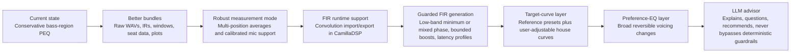

# Deep Technical Research Assessment of the JTS Room-Correction Brief

## Executive summary

The attached file is a plain-text technical research brief, not a design spec, test report, or paper. It defines JTS as an open-source Raspberry Pi 5 smart-speaker project using CamillaDSP, describes the current correction path as intentionally conservative bass-region PEQ, and asks for a source-cited corpus on FIR room correction, house curves, preference EQ, prior art, and safe future LLM guidance. It contains no embedded figures, tables, or experimental data; its “claims” are largely research questions and design intentions. fileciteturn0file1L1-L22 fileciteturn0file1L83-L100

The strongest conclusion from the literature is that JTS’s present conservative posture is technically well founded. Repeatable low-frequency peaks and modal excesses are often amenable to correction, especially when measured over multiple positions; narrow cancellations, strong SBIR nulls, and highly position-dependent features are not reliably fixable with EQ, whether the filter is IIR or FIR. Single-seat “flattening” can easily overfit the room and make other seats worse. citeturn14view1turn14view2turn25search0turn6search11turn36view1turn32view3

FIR is valuable, but only within disciplined boundaries. It can implement minimum-phase, linear-phase, and mixed-phase responses; support crossover and delay equalization; and enable controlled excess-phase/group-delay work that plain PEQ cannot. But audibility of phase correction is context dependent, linear-phase correction can trade accuracy for latency and pre-ringing, and indiscriminate full-range auto-FIR is not justified by the evidence reviewed here. The literature supports windowed, band-limited, measurement-aware, and guardrailed FIR workflows—not magical “fix the room” promises. citeturn18view1turn18view0turn27view5turn27view6turn27view7turn27view9turn28search1

For JTS, the evidence supports a staged path: keep the current deterministic low-frequency PEQ path; improve measurement bundles and diagnostics; add multi-position averaging and calibrated-mic workflows; introduce FIR first as a runtime/export capability and then as a constrained, low-band, mixed-phase option with strict safety rails; and keep room correction logically separate from user preference EQ, even if both eventually compile to the same CamillaDSP backend. The future LLM should explain, question, and advise—but not synthesize unconstrained DSP or bypass deterministic guardrails. fileciteturn0file1L13-L18 fileciteturn0file1L74-L81 citeturn16view2turn16view5turn23view3turn23view4turn14view4turn14view1

## Document profile and source quality

The brief has a clear product purpose: build durable documentation for future JTS agents around four distinct layers—physical room correction, target or house curves, user preference EQ, and later LLM guidance—while keeping those layers “honest” and separate where appropriate. It also explicitly asks that commercial claims not be accepted uncritically, and that physical correction be distinguished from subjective tuning. That framing is technically sound and matches the strongest themes in the literature. fileciteturn0file1L13-L22 fileciteturn0file1L95-L100

A concise reading of the brief is shown below.

| Aspect | What the file says | Assessment |
|---|---|---|
| Document type | Research brief for an open-source smart-speaker project using CamillaDSP on Raspberry Pi 5. fileciteturn0file1L1-L4 | Accurate description of purpose and scope. |
| Current system | Swept-sine measurement at 48 kHz, bass-region PEQ only, cuts by default, bounded filters, CamillaDSP YAML, session bundles. fileciteturn0file1L4-L11 | Strong baseline; aligned with literature favoring restraint in room EQ. citeturn14view1turn23view3turn32view3 |
| Desired future | Calibrated mic support, richer bundles, FIR filters, target curves, LLM-guided explanation. fileciteturn0file1L11-L18 | Reasonable roadmap if introduced in stages and kept guardrailed. citeturn18view1turn16view2turn16view5 |
| Requested findings | FIR fundamentals, room-correction limits, target curves, subjective language mapping, prior art, JTS implications. fileciteturn0file1L23-L81 | Well scoped; all are relevant to a robust JTS corpus. |

The source base for this report was weighted toward primary and official material. For acoustics and DSP, the most important sources were peer-reviewed or original technical documents: Neely and Allen on room-response invertibility, Elliott and Nelson on multiple-point equalization, Welti on multi-sub optimization, Toole on calibration and room curves, Aalto papers on group-delay audibility and loudspeaker delay equalization, DRC-FIR documentation, official REW help, official CamillaDSP documentation, and official rePhase documentation. citeturn25search0turn6search11turn36view1turn32view3turn27view5turn27view6turn18view1turn14view0turn16view2turn18view0

The practical source-quality ranking is as follows.

| Source tier | Included here | How much weight to give it |
|---|---|---|
| Primary and official sources | Peer-reviewed papers and original technical docs; official REW, CamillaDSP, rePhase, DRC-FIR, HouseCurve, and vendor manuals/pages for workflow descriptions. citeturn25search0turn6search11turn36view1turn32view3turn27view5turn18view1turn14view0turn16view2turn18view0turn23view3turn23view4turn21search3turn20search2turn20search3turn23view2 | Highest weight. Used for core technical claims. |
| Strong secondary sources | Toole’s broader synthesis paper and the 2018 room-equalization review. citeturn32view3turn24search0 | Useful for framing and cross-checking, but not the sole basis for disputed claims. |
| Weaker or community sources | Mirrors of legacy PDFs, project docs for young open-source tools such as CamillaFIR/DecayCore, and vendor resource articles used only for workflow/UI comparison. citeturn18view2turn23view1turn21search8 | Useful for transferable ideas, but not proof of acoustic superiority. |

## Verified technical findings

The most stable consensus fact is that room correction is fundamentally a constrained inverse problem, not a general “make the room perfect” problem. Neely and Allen showed decades ago that a room impulse response is only straightforwardly invertible when it behaves as minimum phase; Mourjopoulos and later work showed that room responses vary with position, making exact correction fragile in practice; REW’s official documentation explains the same modern lesson in user-facing terms: peaks are often more correctable than dips, and regions with sharp cancellations or strong excess group delay are poor candidates for aggressive EQ. citeturn25search0turn25search4turn14view2turn14view1

FIR earns its place because it expands the design space. Standard PEQ/IIR room EQ is usually minimum-phase in behavior, so it can mainly reshape amplitude and the minimum-phase component tied to it. FIR, by contrast, can realize arbitrary impulse responses, including minimum-phase, linear-phase, and some mixed-phase responses; rePhase explicitly exposes phase-linearization and FIR generation as first-class features, and DRC-FIR explicitly decomposes an acoustic response into minimum-phase and excess-phase parts, applies frequency-dependent windowing, and can generate either full FIR correction or a minimum-phase version for lower-delay use. citeturn18view0turn18view1

That does not mean FIR is automatically better. The evidence supports a more careful statement: FIR is most useful when you need one or more of the following—controlled time-domain shaping, excess-phase or group-delay correction in bounded bands, long composite target responses, unified export to convolution engines, or crossover and alignment work that is awkward in PEQ alone. It is least persuasive when sold as full-range single-seat “room fixing” from an uncertain measurement chain, because non-minimum-phase cancellations and spatial variability survive regardless of filter type. citeturn18view1turn14view2turn32view3turn25search0

Minimum-phase, linear-phase, and mixed-phase correction should therefore be treated as different tools, not quality tiers. Minimum-phase correction is typically the safest for ordinary room EQ. Linear-phase correction can create constant-latency system responses and help with crossover alignment, but symmetrical impulse responses inherently place energy before the main peak, which is the mechanical basis of pre-ringing or pre-echo concerns. Mixed-phase approaches aim for a middle ground by correcting what appears useful and audible while avoiding the full costs of broad linear-phase inversion. citeturn27view7turn28search1turn18view1

Audibility is central here, and the literature is nuanced rather than extreme. Aalto work reports that local group-delay audibility thresholds depend strongly on signal type and frequency: some critical impulsive signals can reveal variations below about 1 ms, while many real signals require larger deviations; a related Aalto summary notes that around 2 ms in the midrange is a commonly reported order of magnitude; and Karjalainen’s loudspeaker/room equalization paper warns that for high-quality loudspeakers, group-delay errors are often not perceivable even before correction. Put plainly: phase work can matter, but the answer is not “always,” and a consumer system should not market inaudible cleanups as guaranteed benefits. citeturn27view5turn27view6turn27view8turn27view9

Frequency-dependent windowing and impulse-response windowing are not side topics; they are core safety mechanisms. REW describes its ordinary left/right impulse windows as defining the IR segment used to derive frequency response, and its FDW as a Gaussian window that narrows with increasing frequency, progressively excluding late-arriving sound in a way that resembles the ear’s growing emphasis on direct sound at high frequencies. DRC-FIR similarly uses frequency-dependent windowing repeatedly in its filter-generation procedure, including for minimum-phase and excess-phase preprocessing and ringing truncation. For JTS, this means that “FIR generation” is inseparable from “how the IR is windowed, gated, and interpreted.” citeturn14view0turn14view3turn18view1

Latency and computational cost are real implementation boundaries for JTS. CamillaDSP processes audio in chunks; a smaller chunk lowers I/O latency but raises CPU cost, especially for long FIR filters, while longer FIRs beyond the chunk size are handled with segmented convolution. CamillaDSP also notes that FFT size and chunk choice matter for performance, with power-of-two chunk sizes favored. Independent partitioned-convolution work explains why: partitioning a long FIR lowers complexity relative to direct convolution, but the block size becomes the algorithmic-latency term. At 48 kHz, a 1024-sample chunk is about 21.3 ms, 2048 samples about 42.7 ms, and 4096 samples about 85.3 ms, before adding any other buffering or target latency. That is tolerable for music playback, but much less so for tightly interactive voice-monitoring or AV lip-sync scenarios. citeturn16view2turn16view5turn29view1turn29view3

The limits of correction are even more important than the capabilities. REW’s minimum-phase guidance states that reflections of comparable amplitude to the direct sound can create deep cancellations that no amount of equalization can restore, because the direct and reflected signals are both boosted and still cancel; it also states explicitly that narrow-band EQ outside the modal range becomes less useful as frequency rises because the response changes rapidly with microphone position. Toole reaches a similar conclusion from a loudspeaker/room systems perspective: below about 200 to 300 Hz, room modes dominate; above that, anechoic loudspeaker behavior and directivity become decisive; and equalization cannot repair faulty loudspeaker directivity. HouseCurve’s official guidance translates the same idea into product language by recommending broad, not narrow, adjustments above the Schroeder region and advising that single-position measurements not be used for equalization of a listening area. citeturn14view2turn14view1turn32view3turn32view5turn23view3turn23view4

Multiple positions are therefore not optional if JTS wants to improve “how the couch sounds” rather than “how one mic spot looks.” Elliott and Nelson showed as early as 1989 that multiple-point equalization can produce a more uniform response over a larger volume than single-point equalization. Welti’s multiple-subwoofer work makes the same point for bass in especially practical terms: the goal is to reduce seat-to-seat variation first, because only then does global equalization become effective over a seating area. HouseCurve’s official docs are fully aligned with this, recommending 3–5 positions for near-field desks and 3–7 for living rooms, and warning that single measurements should not drive equalization of a listening area. citeturn6search11turn36view1turn36view3turn23view4

The target-curve literature also supports JTS’s design directions, but with some necessary precision. The classic Brüel & Kjær work did not recommend a perfectly flat in-room response for typical commercial recordings; it described a target with a little low-frequency lift and some high-frequency roll-off, derived partly from listening tests and partly from average concert-hall curves. Toole’s 2015 paper shows subjectively preferred steady-state room curves in domestic rooms with a downward slope and explicitly notes that room modes dominate below about 200–300 Hz while directivity and reflected sound remain important above that. The practical implication is that “flat in-room” is not a reliable definition of neutral sound in ordinary reflective rooms. citeturn11view0turn32view3

This should not be confused with a single universal curve. Preferred targets vary with room reflectivity, speaker directivity, listener distance, playback level, and taste. Even vendor resources that advocate downward-sloping targets now explicitly admit that one famous example such as the Harman curve is only a starting point, not a universal law. In other words, JTS should treat targets as bounded presets and user choices layered atop physically grounded correction—not as acoustical truth revealed. citeturn32view3turn23view1turn31search10

The practical comparison that emerges is below.

| Correction approach | Strengths | Main risks | Best JTS use |
|---|---|---|---|
| Conservative PEQ / minimum-phase EQ | Very good for low-frequency peaks and modal excess; low latency; easy to bound. citeturn14view1turn23view3 | Cannot repair deep cancellations or position-sensitive nulls. citeturn14view2turn25search0 | Default consumer path. |
| Minimum-phase FIR | Similar acoustical safety profile to cautious PEQ, but with easy convolution export and longer composite correction responses. citeturn18view1turn16view5 | Still no magic on non-minimum-phase problems. citeturn14view2 | Good intermediate stage if JTS wants one FIR backend. |
| Linear-phase FIR | Useful for crossover/time alignment and constant-latency equalization when that goal is justified. citeturn18view0turn27view7 | Latency and pre-ringing; easy to oversell audibility gains. citeturn28search1turn27view9 | Advanced or expert mode, not first consumer auto mode. |
| Mixed-phase FIR | Can target some excess-phase/group-delay issues while remaining more selective than full linear-phase inversion. citeturn18view1turn27view5 | Requires better measurement, windowing, and safety logic; easier to overfit. citeturn14view3turn18view1 | Later-stage guarded feature, ideally with calibrated mic and multiposition data. |

**Consensus facts.** EQ is most effective on repeatable low-frequency peaks, not narrow nulls; multiple positions matter; above the room-transition region, speaker directivity and broad tonal balance matter more than narrow notch chasing; downward-sloping in-room targets are better supported than flat in-room targets; and FIR is useful when it is measurement-aware and restricted, not when it is marketed as universal full-range salvation. citeturn14view1turn14view2turn32view3turn11view0turn36view1turn18view1

## Claims versus evidence and user-language mapping

The file is unusually careful in the way it frames future work. Most of its implicit claims are supported by the evidence, but some need caveats if they are to become JTS documentation rather than aspiration.

| Claim or direction in the brief | Research verdict | Evidence-based reading | JTS implication |
|---|---|---|---|
| FIR can do things PEQ/IIR cannot. fileciteturn0file1L25-L33 | Supported, with caveats. | FIR can realize linear-phase and some mixed-phase responses and supports explicit phase/group-delay work; PEQ/IIR generally cannot do that in the same way. citeturn18view0turn18view1turn27view7 | Document FIR as an expanded toolset, not as a blanket quality upgrade. |
| Room correction should stay physically honest. fileciteturn0file1L13-L18 | Strongly supported. | Narrow nulls, strong reflections, and position dependence remain hard limits regardless of filter type. citeturn14view2turn25search0turn32view3 | Keep strict bounds, explain limits, and show seat overlays. |
| User preference EQ should be separate from room correction. fileciteturn0file1L15-L18 | Strongly supported. | Physical correction and subjective voicing solve different problems and operate under different evidence standards. citeturn11view0turn32view3turn23view3 | Use separate filter layers and separate bypass states. |
| Multi-position measurement matters. fileciteturn0file1L35-L40 | Strongly supported. | Single-location EQ is not representative of a listening area; multipoint methods improve spatial robustness. citeturn6search11turn36view1turn23view4 | Make multi-position the default whenever the user is tuning a sofa or room rather than a single desk point. |
| Full-range correction is desirable. fileciteturn0file1L35-L48 | Only conditionally supported. | Above roughly 200–300 Hz, broad trends and loudspeaker directivity matter more than narrow-seat notches; equalization cannot repair bad directivity. citeturn32view3turn32view5turn23view3 | If full-range correction is ever offered, it should be broad-band, directivity-aware, and conservative. |
| A future LLM should advise but not hallucinate DSP. fileciteturn0file1L17-L18 | Strongly supported. | Measurement interpretation is subtle, context dependent, and full of false certainty traps. citeturn14view3turn18view1turn32view5 | Let the LLM explain, compare, and ask clarifying questions, but never own final DSP generation. |

The file also asks for a mapping from subjective user language to safe technical actions. The strongest way to do that is to treat this mapping as an engineering heuristic, not a psychoacoustic law. The B&K study shows that listeners do use terms such as bright, dull, full, thin, boomy, harsh, hollow, and nasal in comparative evaluation; HouseCurve and Toole show that above the room-transition region, broad tonal changes are more defensible than notch-by-notch intervention; and low-frequency seat variance literature shows why “boomy” often points to modal excess or sub integration before it points to “add more filters.” citeturn11view0turn23view3turn32view3turn36view1

| User phrase | Likely technical area | Safe first action | Best follow-up question | Main caution |
|---|---|---|---|---|
| More bass | Target curve / preference layer, usually below about 100 Hz | Add a modest low-shelf or raise the bass portion of the target, not room-correction boosts into deep holes | “Do you want more bass in one seat or across the whole room?” | Do not boost below speaker/sub capability or into obvious nulls |
| Less boomy | Low-frequency modes, sub integration, excessive decay | Broad LF cuts, placement/sub timing review, multi-position average | “Is it boomy on all tracks, and in all seats?” | Often a room/sub problem, not a reason to lift nulls |
| Brighter | Broad tilt or top-end target slope | Small high-shelf or gentler downward slope | “Do you want more clarity, or more cymbal bite?” | Avoid narrow HF PEQ from one-seat measurements |
| Warmer | Broad spectral tilt | Slightly more bass / lower mids or slightly less top end | “Warm as in fuller, or warm as in less sharp?” | Easy to drift into muddiness |
| Vocals recessed | Presence region or masking in low mids | Broad adjustment around the vocal presence region, or cleanup of masking LF/low-mid excess | “Are voices recessed on all content or only some mixes?” | Could be directivity/reflection related, not only EQ |
| Harsh | Broad upper-mid / lower-treble excess, or loud reflections | Reduce broad energy in the harshness region; reconsider seat angle or reflective surfaces | “Does it happen only at higher playback levels?” | Could be room reflections or loudspeaker behavior, not a narrow FR error |
| Thin | Lack of bass and lower-mid weight | Small low-shelf or reduced overall top tilt | “Thin at all volumes, or mainly when listening quietly?” | Don’t use this as justification for large boosts below capability |
| Muddy | LF/low-mid excess or modal smear | Broad cleanup in bass/low mids; inspect decay/waterfall | “Is it bass guitar / kick muddy, or voices muddy?” | Often decay and overlap, not a single narrow EQ point |
| Too much treble | Excess top-end slope | Shift to a steeper downward target or add small high-shelf cut | “Too much detail, or too much sibilance?” | Broad tonal control is safer than surgical cuts above the transition region |

A useful JTS rule follows from this table: subjective-language actions should almost always compile into broad, reversible preference filters or target-curve changes first. They should only promote into “physical correction” if the measurements independently support a repeatable acoustical cause. fileciteturn0file1L15-L18 citeturn23view3turn32view3

## Recommended JTS design and implementation ladder

The strongest JTS-specific recommendation is to formalize a boundary between deterministic acoustical processing and advisory intelligence. Measurement capture, alignment, impulse-response derivation, averaging, windowing, minimum/excess-phase analysis, filter optimization, clipping/headroom checks, and CamillaDSP export should remain deterministic code. The LLM layer should read those artifacts, explain them, surface uncertainty, ask clarifying questions, and help users choose among pre-bounded strategies. That division matches both the file’s own intent and the evidence that room correction is easy to overinterpret from shallow or noisy data. fileciteturn0file1L17-L18 fileciteturn0file1L74-L81 citeturn14view3turn18view1turn32view5

The session bundle should become much richer than “capture plus resulting filters.” At minimum, JTS should persist the excitation signal or its identifier, raw recorded WAVs, timing references, derived impulse responses, window settings, every listening position separately, the averaged response used for optimization, group delay and excess-group-delay traces, target curve definition, generated filters, predicted corrected response, applied headroom offset, and enough metadata to reproduce the exact result later. DRC-FIR’s documentation is particularly relevant here because it treats the measured impulse response, minimum/excess-phase decomposition, target response, and test convolution as distinct artifacts, while REW shows how sensitive minimum-phase and group-delay calculations are to window settings. HouseCurve’s multiposition averaging model adds the “listening area” dimension JTS will need. citeturn18view1turn14view3turn23view4

The user and the future LLM both need better plots than a simple smoothed magnitude line. The minimum set is: a raw and smoothed SPL plot with target overlay, all-seat overlay plus average, impulse response and ETC-style early-arrival view, group delay with excess-group-delay, a waterfall or decay view for the bass, and a correction-preview plot showing measured, target, predicted, and filter response. REW and HouseCurve between them already define most of this vocabulary. Without these views, JTS will struggle to distinguish “stuff you can safely correct” from “stuff you should explain and leave alone.” citeturn14view4turn14view3turn23view3turn23view4

Safety limits for FIR generation should be much stricter than “allow any IR inversion.” The evidence supports at least these defaults: use multi-position data for room tuning; treat uncalibrated-mic full-range correction as lower confidence; prefer cuts to boosts; heavily constrain or disable narrow boosts; bias correction toward the low-frequency region where modes dominate; cap the correction bandwidth and enforce broader filters above the transition region; detect and reject solutions that introduce obvious pre-ringing or excessive latency; and always keep a visible, separate preference layer for user voicing. These are engineering recommendations rather than direct quotations from one source, but they are the natural synthesis of REW, DRC-FIR, Toole, HouseCurve, and CamillaDSP’s runtime constraints. citeturn14view1turn14view2turn18view1turn32view3turn23view3turn16view2

The concrete staged ladder below is the most defensible path for JTS.

| JTS stage | What to add | Why this order is justified |
|---|---|---|
| Current baseline | Keep conservative LF PEQ with cuts-first defaults. fileciteturn0file1L4-L11 | Strongly aligned with measurable room-control benefits and low user risk. citeturn14view1turn23view3 |
| Better reproducibility | Rich session bundles, plots, deterministic replay of correction runs | Necessary before FIR, because FIR depends heavily on IR handling and windowing. citeturn14view0turn14view3turn18view1 |
| Better spatial robustness | Multi-position tuning and listening-area averages by default | Single-point equalization is the wrong target for a normal-room product. citeturn6search11turn23view4turn36view1 |
| FIR as infrastructure | Convolution export/import and latency profiles in CamillaDSP | Lets JTS support FIR artifacts without immediately generating risky FIR corrections. citeturn16view2turn16view5 |
| Guarded FIR generation | Minimum-phase FIR first, then bounded low-band mixed-phase modes | Lowest-risk path to actual FIR benefits. citeturn18view1turn27view5 |
| Target curves | B&K-like, downward-slope, “neutral/warm/bright” presets | Supported by room-curve literature and clearer to users than “flat.” citeturn11view0turn32view3 |
| Preference EQ | Broad reversible tone and balance controls mapped from language | Keeps taste separate from physical correction and easier to explain. fileciteturn0file1L15-L18 |
| LLM advisor | Explanation, uncertainty handling, and strategy choice only | Best fit for an LLM; weakest fit is unconstrained filter synthesis. fileciteturn0file1L17-L18 citeturn14view3turn18view1 |

For prior-art comparison, the transferable design ideas are clearer than the product claims. REW is essentially the measurement and interpretation workbench: windows, averages, minimum/excess phase, group delay, and predicted EQ behavior. rePhase is the manual FIR-authoring and phase-linearization tool. CamillaDSP is the runtime engine. DRC-FIR is the most relevant open technical blueprint for serious FIR correction logic. HouseCurve is especially valuable as an example of a consumer-facing, average-first workflow with FIR/PEQ export. Commercial systems such as Dirac, Genelec GLM, Neumann MA 1, and Sonarworks are most useful here as UX references for measurement flow, target editing, auto-calibration presentation, and seat-oriented workflows—not as independent proof of acoustic superiority. citeturn14view4turn18view0turn16view2turn18view1turn23view3turn23view4turn21search3turn21search11turn20search2turn20search3turn23view2

## Corpus outline, primary sources, and limitations

A good JTS documentation corpus should be modular enough that later agents can retrieve exactly one concept at a time without re-learning the entire field. The most practical structure is one markdown file per stable concept, with each file ending in a “used by JTS” section and a “failure modes” section.

| Proposed corpus file | What it should contain |
|---|---|
| `room-correction-fundamentals.md` | Invertibility, minimum phase, excess phase, why correction is limited |
| `fir-vs-peq.md` | What FIR adds, what it does not add, latency and pre-ringing tradeoffs |
| `impulse-response-windowing.md` | Gating, IR windows, FDW, why window settings change results |
| `multiposition-measurement.md` | Why listening-area averages matter, moving-mic vs swept-point averages |
| `target-curves.md` | B&K, Harman-family ideas, downward slopes, neutral vs taste |
| `preference-eq.md` | Subjective language map, broad safe actions, reversibility |
| `bass-correction-and-subs.md` | Modes, multi-sub strategy, seat variance, crossover and timing basics |
| `camilladsp-runtime.md` | Chunks, segmented convolution, latency profiles, YAML/export implications |
| `jts-safety-rails.md` | Hard bounds for boosts, bandwidth, latency, confidence scoring, rollback |
| `llm-advisor-boundary.md` | Deterministic vs advisory responsibilities, prompts, explanation patterns |

The selected primary sources that most deserve to anchor that corpus are these.

| Primary source | Why it matters for JTS |
|---|---|
| Neely and Allen, *Invertibility of a Room Impulse Response* citeturn25search0turn25search4 | Foundational limit on what correction can invert |
| Elliott and Nelson, *Multiple-Point Equalization in a Room Using Adaptive Digital Filters* citeturn6search0turn6search11 | Foundational rationale for multiposition equalization |
| Welti and Devantier, *Low-Frequency Optimization Using Multiple Subwoofers* citeturn36view1turn36view3 | Practical seat-variance-first bass strategy |
| Toole, *The Measurement and Calibration of Sound Reproducing Systems* citeturn32view3turn32view5 | Best synthesis of small-room limits, directivity, and target-curve thinking |
| Liski et al., *Audibility of Group-Delay Equalization* citeturn27view5turn27view6 | Real audibility boundaries for phase/group-delay claims |
| Karjalainen and Paatero, *Equalization of Loudspeaker and Room Responses Using Kautz Filters* citeturn27view9turn4search3 | Why nonminimum-phase work can help, but not always audibly |
| DRC-FIR documentation citeturn18view1 | Open technical blueprint for serious FIR generation |
| Official REW help pages citeturn14view0turn14view1turn14view2turn14view3turn14view4 | Practical reference for windows, phase, group delay, and predicted EQ |
| Official CamillaDSP docs citeturn16view2turn16view5 | Runtime constraints, chunking, segmented convolution |
| Official rePhase documentation citeturn18view0 | Manual FIR and phase-linearization workflow |

A compact glossary that would be useful in the corpus is below.

| Term | Plain-language definition |
|---|---|
| Minimum phase | A response whose amplitude and phase are tightly linked, making inversion comparatively tractable in those regions. citeturn14view2 |
| Excess phase | The phase behavior left over after subtracting the minimum-phase equivalent of the measured magnitude response. citeturn14view2turn14view3 |
| Group delay | The frequency-by-frequency timing delay implied by the slope of phase. citeturn14view3 |
| FDW | Frequency-dependent windowing; a time window that narrows with increasing frequency. citeturn14view0 |
| Gating | Trimming the impulse response in time so late arrivals have reduced influence on the derived frequency response. citeturn14view0 |
| Schroeder or transition region | The approximate crossover from low-frequency modal dominance to denser, more statistically mixed room behavior; in typical small rooms often around a few hundred hertz. citeturn32view3turn23view3 |
| SBIR | Speaker-boundary interference response; cancellations created by direct sound summing with boundary reflections |
| House curve | The target in-room spectral tilt a listener wants the system to approach |
| Multiposition average | A response derived from several listening-area measurements so the tuning reflects the area, not a single mic point. citeturn23view4turn6search11 |
| Pre-ringing | Energy that appears before the main impulse peak, often discussed with linear-phase correction. citeturn28search1turn27view7 |

**Open debates / uncertainty.** The literature does not support one universal target curve; audibility of phase and group-delay correction depends strongly on signal and playback context; the defensible bandwidth for automated full-range correction remains room-, speaker-, and measurement-dependent; and this review did not independently benchmark Raspberry Pi 5 tap-count ceilings on actual JTS hardware. In addition, commercial products such as Audiolense, Acourate, Audyssey, and Sonarworks were not all verified here in equal depth from primary technical documents, so product-comparison conclusions should be treated as workflow observations rather than a ranking. citeturn27view5turn27view6turn32view3turn23view1turn20search3

**Bottom line for JTS.** The brief is directionally strong. The literature supports a JTS architecture that keeps deterministic acoustical correction conservative, area-aware, and evidence-driven; exposes house curves and subjective voicing as separate layers; treats FIR as a bounded advanced capability rather than a prestige checkbox; and uses the LLM as an explainer and restraint mechanism, not as an unconstrained DSP author. fileciteturn0file1L13-L18 fileciteturn0file1L95-L100 citeturn14view1turn32view3turn18view1turn16view2