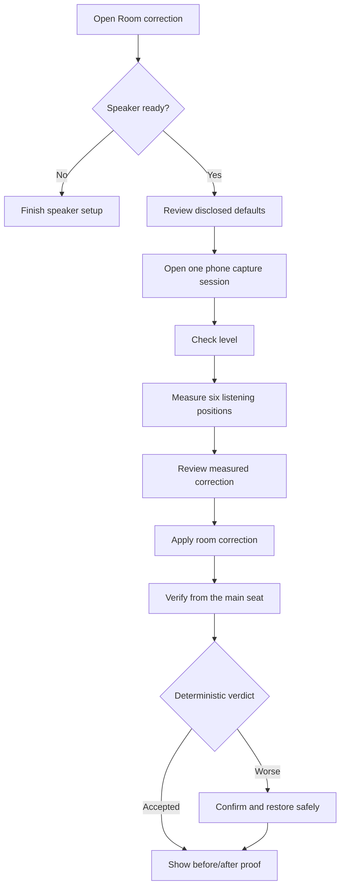

# Room Correction: product and architecture specification

> **Status: design of record.** This document owns the intended Room-tab user
> experience, product states, whole-page visibility, default choices, language,
> and implementation boundaries. Current shipped behavior and operating details
> remain canonical in [`HANDOFF-correction.md`](HANDOFF-correction.md). Shared
> measurement primitives remain canonical in
> [`HANDOFF-audio-measurement-core.md`](HANDOFF-audio-measurement-core.md), and
> driver-domain commissioning remains canonical in
> [`active-crossover-information-design.md`](active-crossover-information-design.md).
> Those documents should link here for Room product behavior rather than restate
> it.

> **Implementation boundary (2026-07-15).** The sequential Room envelope,
> multi-position measurement, IIR PEQ design, deterministic verification, and
> automatic revert loop ship today. R1 now ships the hardware-free
> server-owned entry, defaults, and whole-page visibility contract: envelope
> schema v9
> supplies the exact ordered section list plus closed blocker/failure blocks,
> the browser fails closed without a policy mirror, the named legacy
> containers/actions and certificate-install guide are deleted, and reports are
> discovered only on idle/result envelope edges. A lightweight idle entry read
> refreshes readiness and current-correction presentation together without
> rescanning reports. Idle now consumes the Active-owned
> setup status, allows its explicit passive/not-required result, and withholds
> Start for incomplete, unknown, malformed, or currently unsupported active
> authority. It preserves a validated owner recovery link or bounded Room retry
> and rechecks at `/start`.
> Start, relay, tuning, and stored session failures use closed homeowner copy;
> raw diagnostics remain in logs/evidence, not primary Room surfaces. The local
> fallback binds its realized microphone before level matching and capture.
> `POST /upload-capture` is a mechanism acknowledgement only; after it commits
> the session state, the browser refreshes the envelope for all result copy,
> sections, actions, and curves. The envelope supplies the display-smoothed
> curves and classified helped/hurt segments, so the chart draws them once and
> carries no second smoothing or verdict policy. Detailed confidence, runtime,
> design, spatial-spread, and PEQ evidence remains in durable artifacts, with
> the useful trust summary in Reports, instead of competing with the primary
> household result.
> The envelope and `/start` share the disclosed six-position, flat-target,
> balanced-strategy, automatic-main-seat-repeat policy; the household can choose
> one, three, or six positions and safe or balanced strategy. Relay is preferred
> when configured, the phone's position count is not authority, and follow-up
> capture-only sweeps authenticate the level-check microphone before sound.
> Returning-user preferences, one persistent phone handoff,
> and mandatory proof remain Wave 3 target behavior. Wave 1 added inert evidence
> identities, excitation admission, and an exact automatic Active
> eligibility-receipt contract; it did not make that receipt a live authority.
> Active now also exposes a versioned Room decision that distinguishes an
> explicitly applied manual profile from automatic commissioning. Room consumes
> that one decision: a topology-current manual applied-profile snapshot is
> eligible, while automatic tuning remains blocked until Active issues and
> exposes the exact receipt-backed authority. Room never inspects historical
> evidence or reconstructs either decision.

## Product goal

Room correction should make the speaker sound more consistent across the
listening area without asking a household member to operate a measurement lab.
The normal path is a calm, relay-first sequence with one primary action at a
time, six guided listening positions, safe disclosed defaults, and an honest
before/after result.

JTS should retain the depth that already distinguishes it: reverberant
multi-position evidence, bounded filter design, deterministic verification, and
automatic restoration when a correction made the measured result worse. That
depth belongs behind the server-owned flow; it must not appear as hidden browser
policy or a wall of required choices.

## Product promises

The Room tab makes these promises:

1. **The default path is simple and disclosed.** Before sound plays, the page
   says that it will measure six positions against the flat target. The user may
   choose **Change**, but is not required to configure anything.
2. **Real blockers appear before commitment.** An incomplete speaker setup,
   unavailable live authority, or unsafe graph prevents Start and gives one
   concrete recovery action. Measurement-quality limitations remain visible
   nudges when it is safe to continue.
3. **Relay and local capture are one product.** The phone relay is the default.
   Same-device HTTPS capture is a backup with the same screens, steps, copy, and
   verdicts; only a single plain certificate-warning sentence differs.
4. **The result is measured and reversible.** JTS shows what improved and what
   regressed, verifies the applied correction from fresh evidence, and never
   lets an LLM or browser label overrule the deterministic acceptance verdict.
5. **Room correction stays in the room domain.** It does not infer, repair, or
   address individual drivers. An active speaker becomes eligible only through
   the exact Active-owned readiness authority.
6. **The latency story is honest.** Room v1 designs IIR PEQ only and adds no
   meaningful latency. Imported FIR metadata, when present, is identified with
   its phase mode and measured group delay; Room does not design FIR or weaken
   the existing latency gate.

## Scope

### In scope

- Relay-first and same-device-local capture of the same Room run.
- Guided measurement across distinct listening-area positions.
- A small named target set and bounded correction strategies.
- Reverberant spatial aggregation, measurement-quality nudges, and repeatability
  evidence appropriate to a room.
- IIR PEQ proposal, safe application through the current output topology,
  verification, deterministic acceptance, and rollback.
- Returning-user choices, current-correction status, reports, and optional
  tuning-assistant explanations.
- Passive full-range speakers and active topologies that present the required
  current eligibility authority.

### Non-goals

- Driver measurement, crossover design, driver protection, or repair of an
  incomplete active-speaker setup.
- Bass-management product state. Crossover, Room, and Bass are separate domain
  tabs even when they share policy-free primitives.
- A generic tab, session, envelope, graph, or wizard framework.
- Active's fixed-axis repeat state machine or impulse-response reflection gate.
  Room intentionally measures the reverberant response at different listening
  positions; removing reflections would remove the phenomenon being corrected.
- Automatic selection of the number of positions. Auto-N is deferred.
- Free-drawn target curves on the normal household path.
- Room-authored FIR design, convolution, or any relaxation of
  `correction_latency_eligibility`.
- Publishing the capture page, using a microphone, or claiming acoustic
  acceptance without the serialized hardware-validation track.

## Organizing frame and first principles

The `/correction/` hub has three product domains: **Crossover**, **Room**, and
**Bass**. Their boundaries are load-bearing:

- Crossover owns driver-domain safety, measurement, candidate application, and
  verified eligibility.
- Active owns crossover run identity, timeout and late-success correlation,
  deduplication, and durable crossover state. If an Active-defined API later
  needs Room's shared HTTP surface, Room may add only the thin dispatch or
  transport adapter; it must not move any of that authority into the Room
  session.
- Room owns listening-area measurement, room-filter policy, and the Room run.
- Bass owns bass-management product state when that work is commissioned.

They share only a policy-free primitive after a concrete second consumer proves
the seam. They do not share feature envelopes, product sessions, state machines,
or browser policy. No tab reads or repairs another tab's internal state.

The Room experience follows these principles:

1. One screen has one primary forward action. Stop, cancel, restore, and other
   safety actions may remain available without competing as forward actions.
2. Server presentation contracts own homeowner copy. The envelope owns the
   flow screen, ordered section list, blockers, nudges, and next action;
   `/status` owns the full mechanism snapshot and initial current-config
   banner, while lightweight idle `/entry-status` refreshes that banner with
   speaker readiness. The browser renders those contracts and owns capture
   mechanics; it does not reconstruct product policy.
3. Defaults are visible decisions made for the household, not values hidden in
   form controls.
4. Safety and authority may block. Measurement quality and preference do not
   block when continuing is safe.
5. Room keeps its reverberant, cross-position evidence and its separate
   main-seat trust repeat. Active's fixed-axis, per-driver same-target repeats
   and reflection-gated driver evidence remain Active concerns.
6. A proposal is not live, an applied correction is not verified, and a
   verification result is not accepted until the owning authority says so.

Localization and interpolation do not create a second copy owner. The browser
may insert a localized timestamp or the currently selected server-supplied
labels into a server-supplied sentence template; it must not carry a parallel
sentence, progress-label list, current-config sentence, or repeat disclosure.
A bounded unavailable message may remain in the browser because a server
presentation contract cannot describe its own failure to load.

## Product flow

The local-backup path replaces only the phone-opening step with same-device
microphone permission. Every subsequent screen and decision is the same.

## Screen and whole-page visibility contract

The canonical page shell—domain tabs, Room title, and persistent emergency Stop
while audio may play—is outside the feature envelope. Every feature block below
is inside it. `jasper.correction.envelope` is the sole authority for the exact,
ordered `sections` list. JavaScript maps the pinned section vocabulary to DOM
nodes; an unsupported envelope version or unknown section fails closed to a
bounded refresh/error state with no forward action. It must not carry a second
screen-to-section map or invent a fallback Start action.
When Stop is requested, the shell renders `stopping` and no forward action until
the owning cleanup reaches terminal `stopped`; it does not present that expected
cancellation as a measurement failure.

The section vocabulary is intentionally Room-specific:

| Section | Responsibility |
|---|---|
| `current-correction` | Plain-language applied state and safe reset/restore entry point. |
| `run-defaults` | “Measuring 6 positions with the flat target — Change.” |
| `readiness-blocker` | One blocking reason and the server-owned recovery link. |
| `capture-handoff` | Open/status for the one relay capture session, or equivalent local capture status. |
| `placement` | The placement instruction that is actionable for the next capture. |
| `capture-setup` | Local microphone/calibration controls, only when the backup path is selected. |
| `local-certificate-warning` | One sentence acknowledging the browser warning; never an installation guide. |
| `level-check` | Level progress, headroom, and the bounded level action. |
| `position-capture` | Current position, capture progress, and quality nudges. |
| `measurement-review` | Server-smoothed measured response and the envelope-owned Apply summary. Detailed design/confidence evidence stays in Reports. |
| `apply-status` | In-flight/applied state and what verification will do next. |
| `verification` | Main-seat re-measurement and restoration status. |
| `result-proof` | Authoritative verdict plus mandatory helped/hurt before/after proof from server-smoothed curves. |
| `tuning` | Optional paid assistant explanation/proposal when server-offered; never verdict authority. |
| `reports` | Prior run list/report, only when at least one session exists. |

The ordered visibility contract is:

| Screen | Ordered visible sections | Primary action |
|---|---|---|
| Ready idle | `current-correction`, `run-defaults`, optional `reports` | **Start measuring** |
| Blocked idle | `current-correction`, `readiness-blocker`, optional `reports` | Server-owned recovery link; no Start |
| Microphone / handoff | `run-defaults`, `capture-handoff`, `placement`; local backup additionally gets `local-certificate-warning`, `capture-setup` | **Open phone capture** or **Allow microphone** |
| Level | `capture-handoff`, `placement`, `level-check` | **Check measurement level**, **Retry level check**, or **Measure this position**, as authorized by the envelope |
| Sweep | `capture-handoff`, `placement`, `position-capture` | **Measure this position** / **Measure next position** |
| Review | `measurement-review`, optional `tuning` | **Apply room correction**; **Restore previous sound** when the safe design contains no filters |
| Apply | `apply-status`, optional `tuning` | **Verify correction** once application is confirmed |
| Verify | `capture-handoff`, `placement`, `verification`, optional `tuning` | **Verify correction**, or **Check verification level** for relay capture |
| Result | `current-correction`, `result-proof`, optional `tuning`, optional `reports` | **Measure again**; **Measure again to confirm** for `revert_pending_confirm`; restore is available when relevant |

Conditional sections are decided by the server from the same snapshot as the
rest of the envelope. For example, `reports` appears only when the session store
has a report; the browser does not render an empty first-run panel. The tuning
section appears only on screens with evidence worth explaining and only when the
server offers it. Report discovery is a static-edge concern: the handler may
look it up while building idle or result envelopes, but never on the active
900 ms envelope-poll path. `jasper.correction.envelope` receives the already
computed availability fact and remains pure. R1 must not add a bundle scan,
cache, or index to the hot path merely to decide whether this optional section
is visible.

The R1 migration deletes the six screen-independent legacy containers rather
than hiding them again: the relay explanatory panel and dead Start control, the
always-open placement disclosure, the Advanced disclosure, the old mic-panel
wrapper, the unconditional reports wrapper, and the certificate-install
disclosure. Still-required relay, placement, local-mic, and report mechanics are
rehomed in the envelope-owned sections. Certificate installation, `mkcert`, and
Safari-specific guidance are removed outright.

## Defaults over decisions

The happy path requires no configuration before Start. **Change** opens the
small bounded set of choices without changing the meaning of the run.

| Concern | JTS decides | JTS discloses | User is asked |
|---|---|---|---|
| Capture path | Relay | Phone capture is the default | Nothing; local HTTPS is a backup under Change |
| Positions | Six | “Measuring 6 positions” | Nothing; may choose another supported count under Change |
| Target | Flat | “with the flat target” | Nothing; may choose a small named target under Change |
| Strategy | Balanced, cuts-only | Named in Change and the report | Nothing on the normal path |
| Main-seat repeat | Enabled for both transports | One automatic trust-check capture at the main seat and why it exists | Nothing |
| Mic calibration | Reuse a valid existing setup digest | Selected mic/calibration and any limitation | Act only when selection or calibration needs attention |
| Placement | Server sequences distinct listening positions | One actionable placement at a time | Move the phone/mic, then continue |
| Verification | Return to the main seat | Verification is a fresh like-for-like capture | Continue when placed |

The position count has one owner:
`jasper.correction.session.DEFAULT_ROOM_POSITION_COUNT = 6`. Server session
creation, `/start` fallback, relay and local flows, envelope copy, rendered
options, and tests all consume it. Target and strategy consume the existing
Room-owned `DEFAULT_TARGET_PROFILE_ID` and
`DEFAULT_CORRECTION_STRATEGY_ID`. No JavaScript fallback or selected HTML option
may become a second default.

Relay and local capture must also agree on the main-seat trust repeat. The
single owner is `jasper.correction.session.DEFAULT_REPEAT_MAIN_POSITION = True`.
Session creation, `/start`, relay and local flows, envelope copy, and tests all
consume it; no transport or browser fallback may invert it. The repeat is an
additional trust-check capture at the main seat, not a seventh distinct
listening position. The current transport-dependent values are a defect to
remove, not an intentional product distinction.

## Blockers, nudges, and typed failures

### Blockers

A blocker means JTS cannot safely or truthfully perform the next action. It
withholds that action and presents one recovery route. The named idle blocker is
**speaker setup incomplete**:

> Finish speaker setup first.

The action label is homeowner language, while its link comes from the
speaker-owned readiness response. Room must not hard-code `/sound/` when the
owning authority points to a more specific crossover setup surface.

Other blockers include an active/unknown session, unavailable or stale live DSP
authority, an unsafe graph, capture-integrity failures, inability to restore the
listening volume, and an invalid calibration/device binding when that binding is
required for the requested action. Missing or malformed readiness fails closed.

The existing `/start` readiness check remains defense in depth even after the
idle envelope withholds Start. A browser bug or stale tab must not bypass it.
The shipped Room adapter admits three explicit versioned authority values from
Active: passive/not-required, an operator-applied manual profile, and (once the
producer exists) the exact verified automatic commissioning receipt. Current
automatic applied snapshots do not have that receipt and remain blocked. Room
must not relabel an automatic snapshot as manual, claim receipt-backed or
freshly verified authority, inspect measurement artifacts, or derive a second
rule; the validated crossover setup link remains the active-path recovery
action.

Historical B2b evidence is forensic only: it cannot supply modern candidate or
receipt authority. Automatic crossover readiness must come from Active's fresh,
excitation-admitted captures and measured delay walk. Room consumes that
decision fail-closed and never reconstructs it from historical evidence.

### Nudges

Nudges communicate confidence, quality, and preference without preventing safe
continuation. Examples include an uncalibrated mic, uneven position spacing,
low-but-usable SNR, a noisy capture, poor repeatability, a mic that may not have
moved, or an unusual taste choice. Every nudge says what was observed and the
smallest useful improvement. Continue stays available.

“Nudges never block” applies to these measurement-quality and preference
messages. It does not relabel safety, admission, identity, clipping, or live
state failures as optional.

### Typed homeowner failures

HTTP method, route, status code, exception text, provider name, and raw session
errors belong in structured logs and diagnostics, not page copy. The server maps
known failures to a closed Room-owned vocabulary with:

- a stable reason code for tests and logs;
- one homeowner sentence;
- retryability;
- an optional safe recovery action; and
- diagnostic detail that is never rendered as the homeowner sentence.

Unknown network/server failures use a generic bounded message such as “The
speaker could not continue this step. Try again.” They never become `POST ... →
409` or `status 500` on the page.

## Returning-user state

The Room wizard persists the last confirmed position count, target, and strategy
in the versioned, wizard-owned
`/var/lib/jasper/correction/preferences.json`. A fresh install seeds that exact
path with the safe defaults and `has_saved_choices=false`, owned by
`root:jasper` at mode `0660`. The installer creates it only when absent and
never overwrites an existing valid or corrupt file. Wizard writes use a
same-directory temporary file. They validate it, assign the final
`root:jasper` ownership and `0660` mode, and `fsync` it before atomic replace,
so no published path has an intermediate permission state. The bounded corrupt
sidecar follows the same prepare-before-publish ordering. The implementation
uses or extends the canonical `jasper.atomic_io` helper rather than creating a
second replacement primitive. The first successful run records the confirmed
choices and changes the marker to true. The server validates and pre-applies
those choices before building the disclosed defaults. Browser local storage is
not an authority.

The product distinguishes these states:

| State | Presentation |
|---|---|
| First run | A valid seeded file with `has_saved_choices=false`; show disclosed six/flat/balanced defaults and first-run placement copy. |
| Returning, valid preferences | Last choices pre-applied and named; “Measure again” framing may mention a room change. |
| Preferences missing or corrupt | Typed visible nudge that choices are unavailable; safe disclosed defaults are used, never silently presented as remembered choices or a normal first run. |
| Existing applied correction | Plain-language age/count summary independent of whether preferences were recovered. |
| Incomplete prior run | No invented continuation; show the last durable applied state and start a fresh run after safe recovery. |

Writes are atomic and bounded. Absence, unknown schema versions, or invalid
values fail visibly to disclosed defaults. Reading never silently repairs or
overwrites a corrupt file. When a later successful run replaces invalid state,
the wizard first retains one bounded diagnostic sidecar at
`preferences.json.corrupt`, replacing the older sidecar if necessary. The file
records user choices, not capture blobs, applied DSP authority, or another tab's
state.

## Relay-first capture and one phone handoff

One Room run has one capture-page session. The handoff is opened once and stays
bound to the run through:

1. device/calibration setup;
2. ambient and level checks;
3. all six listening-position captures;
4. any Room-owned trust repeat; and
5. post-apply verification from the main seat.

The Pi remains the product-policy owner. It sends versioned opaque capture specs
and stage transitions; the relay transports encrypted events and blobs without
learning what a listening position, target curve, or acceptance verdict means.
Run token, setup digest, device/calibration identity, event sequencing, timeout,
abort, purge, and volume restoration remain fail-closed.

Same-device HTTPS capture uses the same envelope and stages. It does not grow a
parallel local state machine. Its only extra product copy is:

> Your browser will warn about the speaker's local certificate — continue past
> it.

The in-repo `capture-page/` source and its version gate are part of the software
contract. Publishing a matching `capture.jasper.tech` artifact is an external
release action and requires explicit coordination; a merged Room change must
name the required artifact/version without claiming it has been published.

## Target, filter, headroom, phase, and latency policy

The normal target surface is a small named set: flat, the established reference
targets, and a bounded warmth choice. It has no free-draw editor. Correction and
preference share the target vocabulary while remaining separate DSP layers:
Room removes repeatable room deviation and Sound owns subjective preference.

Room v1 designs IIR PEQ only. Its safe default is the balanced, cuts-only
strategy. The target household contract is code-enforced rather than merely
explained in copy:

- cuts-only by default, consuming 0.0 dB of positive-boost budget;
- a +3.0 dB hard total-positive-boost ceiling, calculated by the canonical
  `total_positive_boost_db()` helper whenever a non-default strategy permits
  boost;
- −10 dB per-filter cut floor;
- Q clamped to 1.0–8.0;
- no positive correction within the established ±1/3-octave crossover band;
- non-positive device volume ceiling; and
- graph safety re-proven before apply/reset.

Today the legacy Assertive strategy exceeds the intended −10 dB / Q 1.0–8.0
household bounds, so it is excluded from the household **Change** surface until
R5 brings it inside those bounds. R1 owns the exclusion through one Room-owned
`HOUSEHOLD_CORRECTION_STRATEGY_IDS = ("safe", "balanced")` allowlist in
`jasper.correction.strategy`. Both rendered options and `/start` validation
consume that allowlist; browser-only hiding is not an authorization boundary.
R5 may add Assertive only in the same change that brings it inside the household
bounds and re-proves them with guard tests. If an expert strategy is then
exposed, its positive-boost behavior is named explicitly and the +3.0 dB total
ceiling still applies. “Cuts-only default” must never be presented as “all
strategies are zero-boost.”

No Room phase correction or FIR design is authorized by this specification.
When an actually applied bundle carries FIR metadata from an imported artifact,
the proof surface displays its phase mode and `filter_group_delay_ms` next to the
before/after result. Missing FIR metadata is not inferred. Existing
`correction_latency_eligibility` continues to block unknown or over-budget
convolution latency from low-latency paths.

## Proof and acceptance authority

The result screen leads with the deterministic
`jasper.correction.acceptance.AcceptanceEvaluator` verdict and the mandatory
helped/hurt spread. It compares like with like using the established matched
main-seat basis, 1/3-octave aggregation, repeatability threshold, and
confirmatory re-measure before automatic revert.

The tuning LLM may interpret evidence or propose a bounded tweak. The browser
may draw the envelope's display curves and format server-owned text. It does
not recompute smoothing, confidence, acceptance, or the next action. Neither
the LLM nor browser may replace, soften, relabel, or suppress the acceptance
verdict. A failed automatic restore must continue to say that the correction
is **still applied** and present the safe manual recovery action.

At minimum, the result names:

- whether the correction was accepted, needs review, or was restored;
- the before/after headline and helped/hurt frequency spread;
- relevant server-owned measurement nudges;
- current correction state in plain language;
- any FIR phase mode/group delay proven by applied-bundle metadata; and
- the next safe action.

Detailed confidence and runtime-integrity summaries remain available through
the read-only report. Full design, spatial-spread, and individual-PEQ evidence
remains in the durable session artifacts. They are not parallel decision panels
in the primary flow.

## Architecture and ownership

Host-mediated indirection from [`extensibility.md`](extensibility.md) applies:
leaf analysis and transport code receive narrow data/callbacks, never a powerful
web handler, Room session host, Active host, or CamillaDSP controller.

| Concern | Owner | Must not own |
|---|---|---|
| Room product session and state machine | `jasper.correction.session` | Browser DOM, Active commissioning, or relay transport policy |
| Whole-page visibility and next action | `jasper.correction.envelope` | Active readiness derivation or HTTP side effects |
| Closed homeowner failure presentation | `jasper.correction.failures` | Diagnostic capture, Active authority, or feature state transitions |
| HTTP admission and context assembly | Room handlers under `jasper.web` | Acoustic math or a second product state machine |
| Upload acknowledgement | Room handler under `jasper.web` | Result presentation, chart policy, or verdict copy |
| Sweep, deconvolution, calibration, and shared quality primitives | `jasper.audio_measurement` | Room positions, target policy, or product sequencing |
| Reverberant cross-position aggregation | `jasper.correction.spatial` | Active same-target repeat/admission policy |
| Room capture analysis and quality report composition | Room analysis modules under `jasper.correction` | HTTP, paid calls, or live DSP mutation |
| Driver reflection gating and fixed-axis repeats | Active-owned adapters using shared primitives | Room listening-position policy |
| Neutral content identities | `jasper.audio_measurement.evidence_identity` | Runtime capabilities, authority issuance, or persisted-bundle migration |
| Bundle and playback neutral migration | Shared lane's selected `jasper.audio_measurement` homes | Room racing `correction/bundles.py` or `correction/playback.py` during migration |
| Level ramp kernel | `jasper.audio_measurement.ramp` | Room/Active product policy |
| Room level adapters | `jasper.correction.level_match`; local fallback in `jasper.correction.autolevel` | Relay session minting or HTTP responses |
| Tuning paid call and spend cap | `jasper.web.correction_tuning` | Acceptance authority or live apply |
| Capture transport | `jasper.capture_relay.spec.CaptureSpec` and relay client/session | Position, target, or verdict semantics |
| Capture-page stage UX | `capture-page/`, driven by Pi-authored specs | Room policy or analysis |
| Target and filter policy | `jasper.correction.strategy` / `jasper.correction.peq` | Browser-selected unbounded values |
| Positive-boost accounting | `jasper.camilla_config_contract.total_positive_boost_db` | Product sequencing |
| Bass-management corner | `jasper.camilla_emit`, read through bass-management adapters | Room-owned duplicate constants |
| Active eligibility receipt | `jasper.active_speaker` | Room inference, repair, or per-driver validation |
| Acceptance verdict | `jasper.correction.acceptance.AcceptanceEvaluator` | LLM/UI override |
| Returning-user choices | Versioned Room wizard file under `/var/lib/jasper/` | Applied DSP or cross-tab state |

Envelopes remain domain-specific. If Room and Active share progress walking, the
shared helper may only index an already-normalized item in a supplied spine and
return `{position, total}`; each feature keeps aliasing and fallback policy.

## Durable evidence and observability

Room keeps the existing replay-grade session/bundle path and
`/var/lib/jasper/correction/sessions` compatibility until the Shared lane lands
and identifies the neutral migration API. A refactor must preserve persisted
bytes, paths, status/envelope bytes, and replay behavior unless a separately
versioned change says otherwise.

Stable `event=` logs cover envelope screen transitions, readiness rejection,
typed failure reason, preference fallback, relay-stage transitions, apply,
verification, acceptance, restore, and failed restore. They record diagnostic
reason codes and identities needed to fix a problem without logging secrets or
spamming on every poll. `/state`, reports, and bundle tools remain the
maintainer-facing evidence surfaces; homeowner copy remains concise.

## Language guide

Prefer:

- **Room correction on — 3 adjustments applied 2 days ago**
- **Measuring 6 positions with the flat target — Change**
- **Finish speaker setup first**
- **Open phone capture**
- **Put your phone at the main seat**
- **Move to position 2 of 6**
- **Measure this position**
- **Apply room correction**
- **Verify correction**
- **This improved the measured response**
- **Restore the previous correction**
- **Measure again — moved the couch?**

Avoid as primary product copy:

- PEQ filters;
- MMM averaging;
- arm capture;
- capture spec or setup digest;
- commissioning receipt;
- applied recomposition snapshot;
- evidence fingerprint mismatch;
- endpoint, HTTP method, URL, or status code strings;
- provider-specific names; and
- “success” when a restore failed and the correction remains applied.

Technical vocabulary may remain in diagnostics and exported evidence when it
helps a maintainer reproduce the result.

## Acceptance criteria

The intended Room product is complete only when:

1. Idle shows one verdict line, disclosed six/flat defaults, and one Start
   action; no empty report, certificate guide, or always-open setup panels.
2. The server envelope pins the exact ordered section list for every screen;
   JavaScript contains no independent screen-visibility or forward-action map.
3. Incomplete/malformed speaker readiness withholds Start, presents a typed
   blocker and server-owned recovery link, and remains rejected by `/start`.
4. Relay and local backup share envelope, defaults, repeat policy, steps, copy,
   and verdicts; only the local certificate sentence differs.
5. One relay handoff remains valid through level, all listening positions, and
   verification, with version/run/device/calibration binding intact.
6. Six is owned by one Room constant and used by every server/browser path;
   flat and balanced use their existing Room default constants; the rendered
   strategy choices and `/start` accept the same household allowlist.
7. Missing/corrupt returning-user state is visible and safely falls back to
   disclosed defaults; valid state is pre-applied and named; install never
   overwrites existing preference state.
8. No raw route/status/exception/session error reaches homeowner copy.
9. The default result always shows the deterministic verdict and helped/hurt
   proof; the LLM/UI cannot override it.
10. Cuts-only default, total-positive-boost ceiling, −10 dB cut floor, Q clamp,
    crossover no-boost band, and volume/graph safety have guard tests.
11. Room continues to use reverberant cross-position evidence and does not adopt
    Active reflection gating or same-target repeat state.
12. Room apply on an active topology consumes the exact current eligibility
    result without inference; passive topology behavior remains explicitly
    tested.
13. IIR-only design and the existing latency gate remain intact; FIR phase/group
    delay appears only with proven applied-bundle metadata.
14. First-run decisions do not exceed five before the first sweep, and the relay
    happy path takes no more than two taps: Start, then the phone handoff.

## Delivery and hardware gates

Hardware-free changes may establish this product contract, envelope, errors,
defaults, persistence, module boundaries, and tests. They do not prove the
browser/microphone/acoustic experience.

The serialized hardware track must still perform:

- the real-device Room browser pass for relay and local backup;
- six-position duration and interaction checks;
- phone-vs-calibrated-mic evidence before publishing any accuracy claim;
- H1 settle-cadence tuning, AGC-freeze confirmation, and measured retuning of
  placeholder `JASPER_ACCEPT_*` / `JASPER_RAMP_*` thresholds;
- audible apply/verify/restore evidence on the production chain;
- exact automatic Active receipt issuance/consumption on an active topology;
- capture-page artifact publication/version coordination.

No Pi deployment, microphone use, phone publication, or audible acceptance is
implied by a hardware-free merge.

Last verified: 2026-07-15
